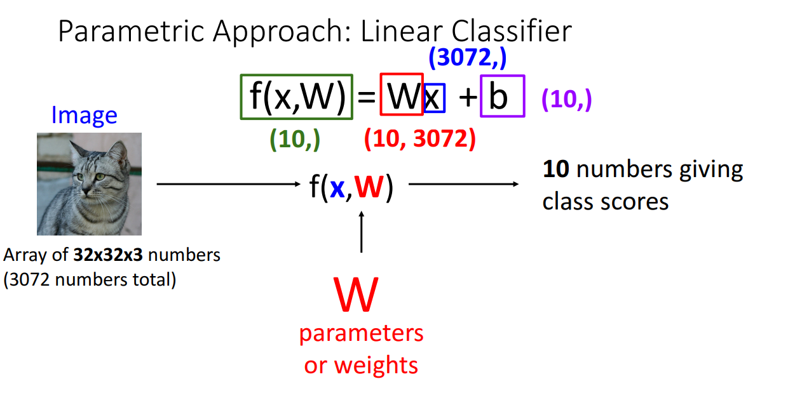

# 3강 - Linear Classifiers

# 키워드

- 이미지 분류, 컴퓨터 비전, 선형 분류기, 신경망, 매개변수적 접근, 가중치 행렬(W), 편향(B), 분류 점수, 대수적 관점, 시각적 관점, 템플릿 매칭, 모드 분할, 기하학적 관점, 초평면, 결정 경계, 퍼셉트론, XOR 함수, 손실 함수, 데이터 손실, SVM 손실, 마진, 힌지 손실, 교차 엔트로피 손실, 소프트맥스 함수, 확률 분포, 로짓, 최대 우도 추정, 정보 이론, KL 발산, 엔트로피, 정규화, 과적합, L1 정규화, L2 정규화, 엘라스틱 넷, 최적화.

# Linear Classifier

## Parametric Approach

- Linear Classifier는 데이터를 분류할 수 있는 결정 경계를 선형으로 찾는 분류기
- 1차 함수 식은 $f(x) = ax + b$이므로 가중치 W에 대해 $f(x, W) = Wx + b$를 가설 함수로 설정
- 우리는 데이터 x에 대해 가장 적합한 (모든 데이터 x를 다 넣었을 때 차이가 가장 적은)
W와 b를 찾는 것이 목표

## Interpreting a Linear Classifier

### Algebraic Viewpoint

- 이미지 형태의 데이터를 Flatten해서 가중치 W를 행렬 곱하고 bias를 더하는 계산 과정으로 볼 수 있음
- Bias Trick
    
    
    
    - Bias 또한 W와 마찬가지로 $W_b$$X_{=1}$로 생각하여 행렬 곱셈 한 번으로 연산 끝낼 수 있다
    - Bias도 가중치이다
- 선형성
    
    
    
    - 선형의 조건
        - $f(x_1+x_2) = f(x_1)+f(x_2)$
        - $f(cx) = cf(x)$
    - 선형성에 따라서 데이터 x에 대해 cx를 입력으로 준 결과 값과 x를 입력으로 준 결과 값에 c 곱한 것과 동일함
    - 여기서 말하는 0.5*image는 각 픽셀 값마다 0.5만큼 곱한 것으로 해석해야 함
    but 그림에서는 이미지가 흐릿해지는 것으로 표현 → 이상하다
    픽셀 값에 0.5 곱하면 그만큼 어두워져야 하는데 그림에서는 투명도가 0.5가 된 것으로 됨
    식: 0.5 image + 0.5 white

### Visual Viewpoint

- 계산 되어진 W 행렬을 이미지 형태로 바꿔보면 각 class마다 적용되는 템플릿으로 해석 가능함
- 이 템플릿은 이미지 데이터셋의 각 class에 해당하는 모든 이미지에 적합해야 함
- 따라서 horse 같은 경우 왼쪽 보는 말과 오른쪽 보는 말 모두 담기 위해서 템플릿 보면 말 머리가 2개임
- 선형 분류는 템플릿 매칭과 같다

### Geometric Viewpoint

- 기하학적 관점으로는 말 그대로 각 class를 분류하는 경계선을 그리는 것
- 3차원으로 가면 경계 평면, 고차원으로 가면 초평면 그리는 것
- 모든 지점에 대해서 각 클래스마다의 score 매길 수 있다 → 이를 확률로 표현? Softmax!
- 어떤 지점에서는 Car와 Deer가 score가 같을 수도 있다 → 그만큼 이미지가 굉장히 애매하다는 것
- 아니 근데 저 2차원 그래프에서 각 축마다 pixel(15, 8, 0), pixel(11, 11, 0) 뭔 의미임?

## Hard Cases for a Linear Classifier

- 선형으로 결정 경계를 구분 지으려고 하기 때문에 데이터 분포가 선형적이지 않으면 불가능함

- Linear Classifier는 단일 퍼셉트론이고, 단일 퍼셉트론은 XOR 문제를 해결하지 못한다
- 왜냐하면 마찬가지로 선형으로 결정 경계를 구분할 수 없기 때문
- 이를 해결하고자 나온 아이디어가 MLP → 여러 개의 선형 결정 경계를 새로운 축으로 데이터를 변환하면 선형으로 분류 가능한 분포로 만들 수 있다 → 은닉층에서의 비선형 함수의 역할은 특징 변환

# Loss Function

## Why we define a linear score function?

- 우리의 목표는 데이터 x에 대해 가장 적합한 W와 b를 찾는 것
- 그러면 W와 b가 가장 적합한지 여부는 어떻게 판단할 것인가? → loss function의 역할
- W와 b가 가장 적합하다는 것은 loss function의 값을 최소화 시킨다는 것과 같은 말

## Loss Function

- loss function은 현재 분류기가 얼마나 좋은지 말해준다
- 데이터셋에는 수많은 데이터 샘플이 존재
- 각 샘플마다의 loss를 구한 다음 더해서 샘플 개수만큼 나누면 그게 데이터셋 전체에 대한 평균 loss임

### Multiclass SVM Loss

- SVM(이진 분류)의 컨셉은 결정 경계를 만들 때 결정 경계와 가장 인접한 데이터 샘플들(결정 경계에 해당하는 class와 아닌 class)과의 거리가 최대가 되도록 만드는 것 → Margin을 최대로 하는 결정 경계를 만드는 것
- Multiclass SVM의 컨셉은 결정 경계에 해당하는 class의 score가 최대한 나머지 class에 해당하는 데이터에 대한 score와 차이가 크도록 만드는 것 → Margin을 최대로 하는 결정 경계를 만드는 것
- 즉, 본인 class의 score가 나머지 class의 score보다 최대한 높게 나타나야 함 ex)[1, 9999, 0]
- $L_i=\sum_{j\ne y_i}max(0,s_j - s_{y_i}+1)$
    - 나머지 class들에 대한 각각의 score($s_j$)와 현재 결정 경계에 해당하는 class의 score($s_{y_i}$)의 차이가 1 이상이고 $s_{j} < s_{y_i}$이어야 한다
    - loss가 커진다는 것은 그만큼 현재 결정 경계가 나머지 class들과 완벽하게 분리가 안된다는 것

- Q1: 자동차 이미지의 점수가 약간 바뀌면 loss가 어떻게 될까?
    - A1: -1 이하냐 이상이냐에 따라 달라짐
- Q2: Loss의 min과 max가 무엇일까?
    - A2: min=0, max=$\infin$
- Q3: 만약 모든 score가 가우시안 분포에서 랜덤이라면 loss의 기댓값은 무엇일까
- Q4: 만약 모든 class에 대해 더하는 것으로 loss를 계산하면 어떻게 될까?(including $j=y_i$)
    - A4: 기존의 것에 1만큼 추가된다
- Q5: 만약 loss를 sum이 아닌 mean으로 바꾼다면 어떻게 될까?
    - 
- Q6: 만약 loss를 제곱의 합으로 바꾸면 어떻게 될까?$L_i = \sum_{j\ne y_i}max(0, s_j-s_{y_i}+1)^2$
    - A6: 기존보다 loss 값이 더 극대화 된다 → 이상치에 민감해지는 단점 즉, 이상치가 loss 값에 영향을 너무 많이 준다

### Regularization

- L=0이 되게 하는 W가 과연 하나만 존재할까? NO! 여러 개 존재!

- 그러면 W가 좋은건가 2W가 좋은건가? → 결론은 W가 더 좋다; 오버피팅 방지

- W가 커진다는 것은 다시 말해 데이터 샘플에 대해 민감하게 반응한다는 것
- 훈련 데이터셋에서만 학습한 모델이 만약 테스트 데이터셋에 대해 진행한다면?
W가 커져도 훈련 데이터셋에서는 괜찮았는데 테스트 데이터셋에서 진행하니 예측 값 변동성이 너무 큼
→ 오버피팅
- 따라서 W 값 자체를 줄이는 것도 일반화를 위해서 중요하다 → Regularization 도입
- W 값이 줄어든다는 것은 그만큼 모델이 간단해진다는 의미이기도 하다
- Regularization을 loss function에 더해주는 것으로 optimization 성능 높일 수 있다 → 곡률 추가 why?
convex 느낌일 것 같긴 함 → 좀 더 조사

### Cross-Entropy Loss (Multinomial Logistic Regression)

- $\begin{aligned}
\text{Cross Entropy }H(P, Q) &= H(P) + D_{KL}(P||Q) = -\sum P(x)logQ(x) = -\sum logQ(x)\\ \text{where }H(P) &= -\sum P(x)logP(x);\;\ D_{KL}(P||Q) = \sum P(x)log\frac{P(x)}{Q(x)}
\end{aligned}$
- P가 실제 label이고 Q가 예측이라고 하면 Shannon Entropy H(P)는 0이다
→ label은 one-hot encoding에 의해 [1,0,0]과 같음
→ [1,0,0]을 가지고 계산해보면 $-(1log1 + 0log0 + 0log0) = 0$
- Q1: Loss의 min과 max가 무엇일까?
    - A1: min=0, max=$\infin$
- Q2: 만약 모든 score가 랜덤한 작은 값이라면 loss의 기댓값은 무엇일까?
    - A2: -log(C) C: 클래스 개수

## Cross-Entropy vs. SVM Loss

- Q1: 마지막 데이터 샘플의 score를 약간 바꾸면 어떻게 될까?
- Q2: correct class score를 2배로 늘리면 어떻게 될까?

# 결론

