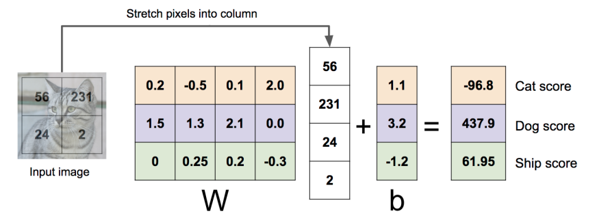

# 4강 - Optimization

# 키워드

- 최적화, 손실 함수, 가중치 행렬(W), 손실 지형, 경사 하강법(Gradient Descent), 미분, 경사(Gradient), 수치적 경사, 해석적 경사, 경사 확인(Gradient Check), 하이퍼파라미터, 가중치 초기화, 반복 횟수, 학습률(Learning Rate), 배치 경사 하강법, 확률적 경사 하강법(SGD), 미니 배치, 배치 크기, 지역 최소값(Local Minima), 안장점(Saddle Point), 조건 불량 문제, 경사 노이즈, 모멘텀(Momentum), 속도 벡터, 네스테로프 모멘텀(Nesterov Momentum), 적응적 학습률, AdaGrad, RMSProp, Adam, 지수 이동 평균, 편향 보정, 1차 최적화, 2차 최적화, 헤시안 행렬.

# Last Time

## Linear Classifiers

- Algebraic Viewpoint
    - f(x, W) = Wx
    
    
    
- Visual Viewpoint
    - One template per class
    
    
    
- Geometric Viewpoint
    - Hyperplanes cutting up space
    
    
    

## Loss Functions quantify preferences

Q. 우리는 어떻게 가장 좋은 W 값을 찾을 수 있을까?

A. Optimization

# Optimization

$$
w^* = argmin_wL(w)
$$

- $L(w)$: 지난 강의에서는 이 Loss Function의 내부에 대해 배웠었지만, 여기에서는 그저 w를 input으로 하여 loss를 스칼라 값으로 output하는 추상적인 함수로써 볼 것이다.
- $w^*$: loss function을 최소화하는 가중치 행렬 $w^*$ 찾기 → Optimization

- Optimization은 마치 눈이 안 보이는 상태에서 바닥까지 내려가려는 상황과 비슷하다고 볼 수 있다.

### Q. 어떻게 바닥까지 도달할 수 있을까?

- 답을 명시적으로 적어서, 다시 말해 바닥까지 가는 길을 명시적으로 알려주면 도달할 수 있을 것이다. 선형 회귀에서는 명시적으로 답을 방정식으로 쓸 수 있다. 하지만 일반적으로는 효과가 없으니 우리는 반복적으로 method를 수행함으로써 바닥까지 이동하고자 한다.

## Idea

### 1. Random Search

- CIFAR10 데이터 셋으로 진행한다 가정. 32 x 32 x 3 = 3073.
- 1000번 반복해서 매 step마다 w를 랜덤으로 생성. 이 w를 가지고 loss 계산해서 가장 작은 loss일 때의 최적의 w를 지속적으로 업데이트 하는 방식.

- 정확도는 15.5%. SOTA(State of the art: 최첨단)는 95%. 바보 같지만 생각만큼 나쁘지 않을 수도 있다.

### 2. Follow the slope(경사)

- 우리가 실제로 수행할 방법
- 눈이 없는 상태에서 서 있는 지점 근처의 경사 정보를 안다면 가장 크게 감소되는 경사 방향으로 조금씩 움직일 수 있다. 이걸 반복한다면 언젠가 바닥에 도달할 것이다.

$$
\frac{df(x)}{dx} = \lim_{h\rarr0}{\frac{f(x+h)-f(x)}h}
$$

- 1차원에서 함수의 미분은 slope 그 자체와 같다.
- 다차원에서의 gradient는 각 차원에 대한 slope(partial derivatives: 편미분)를 저장한 vector를 말한다.
- 가장 경사진 하강 방향은 negative gradient.
- Numeric Gradient
    - 임의의 h 값을 선택해서 각 w마다 직접 계산하는 방법
    
    
    
    - 시간 복잡도 O(#dimensions) - 느리다, 차원이 커질 수록 비효율적이다.
    - h를 임의로 정해서 근사치를 구한 것이기 때문에 정확한 값이 아니다.
- Analytic Gradient
    - $\frac{dL}{dW}$는 data와 W에 대한 어떠한 function이다.
    - backpropagation을 사용해서 $\nabla_wL$구할 것이다. 6강에서 다룸.
- Numeric vs. Analytic
    - Numeric: approximate, slow, easy to write
    - Analytic: exact, fast, *error-prone*
        - *error-prone* → 실제로 기울기 유도하려면 여러 작업을 거쳐야 한다. 실수 발생 가능성 높다
- 실제로는 둘 다 사용하는 경우가 많다. Analytic Gradient를 디버깅 할 때 Numeric Gradient를 이용해서 한다. → gradient check
    - gradient check를 함수로 표현
        
        
        
    - pytorch에서 제공하는 gradient check 메소드
        
        
        
        - 비교하는 방식은 allclose()을 통해서 비교
            - allclose(): $|input - other| \leq atol + rtol \times |other|$
            - $|input - other|$가 계산된 최대 허용 오차를 넘지 않으면 True
        - $eps$: Numeric Gradient를 할 때 사용할 h의 값
        - $atol$: absolute tolerance (절대적 허용 오차) — 값 크기와 무관하게 항상 허용되는 최소 오차
        - $rtol$: relative tolerance (상대적 허용 오차) — 기준 값 크기에 비례해서 추가로 허용되는 오차
        - $raise\_exception$: False가 났을 때 에러를 발생 시킬 것인지 여부
        - $check\_sparse\_nnz$: sparse(값이 대부분 0인) tensor를 허용할 것인지 여부
            - 2.x버전(최신 버전)에서는 check_sparse_nnz가 masked로 바뀜
        - $nondet\_tol$: 비결정성에 대한 허용 오차. 동일한 입력을 미분에 적용했을 때 완전히 같은 결과(기본값: 0.0)가 나오거나, 이 값 만큼의 오차 내에서 나와야 함
    - pytorch에서 제공하는 2차 gradient check 메소드
        
        
        

# Gradient Descent

- negative gradient 방향으로 매 step마다 반복해서 이동하는 방식
- Hyperparameters
    - Weight initialization method — 랜덤한 값으로 할 수 있지만, 임의의 값을 구하는 정확한 분포의 정확한 매커니즘은 매우 중요하다
    - Number of steps — 반복 횟수
    - Learning rate — gradient는 방향을 제공하고, 실제로 얼만큼 이동할 지 정하는 hyperparameter이다. 얼마나 빨리 학습하는지 정도를 제공해서 ‘학습률’이라고 한다.
- 특징
    
    
    
    1. 바닥으로 바로 가지 않고 돌아서 내려가다가 바닥이 있는 평평한 지형에 도달 했을 때 바닥으로 간다.
    2. 가파른 지형에서 내려갈 때 빠르게 내려가다가 평평한 지형 만나면 조금씩 간다. gradient가 작아지니까 그만큼 적게 이동한다.

## Batch Gradient Descent

- 우리가 지금까지 한 것은 Full Batch Gradient Descent이다.
- 모든 data sample에 대해서 loss function 계산하고 이를 미분해서 최적화 함.
- data set이 너무 커지면 그만큼 loss function 계산하는 비용이 커진다. → SGD의 필요성

## Stochastic Gradient Descent (SGD)

- 원래 SGD는 매번 데이터셋의 샘플 하나를 랜덤으로 뽑아서 그 샘플만 가지고 w를 업데이트 하는 방식임
- 딥러닝에서 말하는 SGD는 일반적으로 Minibatch SGD를 말하는 것임

- loss function을 data sample 전부가 아니라 minibatch만큼 써서 계산하여 근사하겠다.
- 일반적으로 minibatch의 크기는 32, 64, 128로 사용한다.
- Hyperparameters
    - Weight initialization
    - Number of steps
    - Learning rate
    - Batch size — minibatch 크기 얼만큼 할 것인지
        - 일반적으로는 GPU memory가 감당할 수 있는 최대 크기로 설정함.
        - 강의에서 말하길 경험적으로 그렇게나 민감하진 않음.
    - Data sampling — 각 반복마다 data sampling 어떻게 할 것인지
        - 일반적으로는 전체 data sample를 shuffle하고 위에서부터 일정 크기만큼 뽑는다.
        - 매 반복마다 새로 shuffle하고 뽑는다.

- loss를 전체 데이터 분포에 대한 expectation으로 생각할 수 있는데, SGD는 이를 sampling을 통해서 근사하는 것으로 볼 수 있다.
- 즉, minibatch라는 표본집단으로부터 전체 데이터셋이라는 모집단의 기댓값을 추정하는 것으로 해석

- gradient 또한 sampling을 통해 근사하는 것으로 볼 수 있다.

### Problems with SGD

- 만약 loss가 한쪽 방향에서는 빠르게 변하고 다른 방향에서는 느리게 변한다면?
Loss function has high condition number: ratio of largest to smallest singular value of the Hessian matrix is large
condition number(조건수): input 값의 작은 변화율 대비 output 값의 변화율이 얼마나 큰지, 민감도.
Hessian matrix의 특이값이 크다 → 곡률이 가파르다, 작다 → 곡률이 완만하다
비율이 크다 → 그만큼 곡률이 불균형 하다 → 한 방향으로는 “깊이 파고” 한 방향으론 “거의 진전 없는” 불안정한 수렴
비율이 작다 → 그만큼 곡률이 균형적이다 → 모든 방향에서 곡률이 비슷해서 스텝 크기 선택이 쉽고, 균일한 수렴 속도를 기대 가능
    
    
    
    - 얕은 dimension을 따라서 느리게 진행되고, 가파른 방향에 따라서 jitter가 발생된다.
    - step size 너무 크면 진동할 수 있고, step size 너무 작으면 수렴할 때까지 오래 걸린다.
- loss function이 local minimum or saddle point(안장점)를 가지고 있다면?
    
    
    
    - local minimum: gradient = 0이지만 함수의 바닥은 아니다
    - saddle point: gradient = 0이지만 감소하는 방향이 존재한다.
        - 안장점 vs. 변곡점
            - 안장점: 특정 방향에서는 극대값을 가지지만 다른 방향에서는 극소값을 가지는 점을 의미
            - 변곡점은 함수의 오목/볼록성이 변하는 점을 의미
            - 안장점 $\sub$ 변곡점
    - gradient = 0이니까 거기에 머무르게 된다.
- SGD의 gradient는 minibatch로부터 계산된 것이므로 noisy가 있을 수도 있다.
    - gradient 방향이 정확하지 않으니까 때로는 우리가 원하는 방향과 다르게 갈 수 있다.

### Q. Full Batch에서 GD를 수행한다면 noisy가 없는가?

- 엄밀히 말해서 noisy는 없다. 하지만 불안정한 현상이 발생할 수 있어서, 마치 noisy처럼 보일 순 있다.
1. overshooting 2. Zig-zagging 3. 고차원 지형의 복잡성(ex. saddle point)

## SGD + Momentum

- 앞선 문제들이 있어서 SGD 단독으로는 잘 사용하지 않는다.
- 실제로 일반적으로 사용하는 것은 Momentum을 결합한 버전이다.

- 관성: 힘을 유지하려는 성질
- $v_{t+1}$: 시간에 따른 기울기 통합해서 언덕 아래로 굴러가는 공이 유지하고 있는 속도를 계산
    - 과거 누적된 velocity vector와 현재 기울기를 합해서 가중 이동 평균으로 매 step마다 velocity vector를 업데이트
    - 가중 이동 평균: 1일 10, 2일 20, 3일 30일 때 3일에 대한 가중 이동 평균은 $\frac{1\times10 + 2\times20 + 3\times30}{1+2+3} = \frac16\times10 + \frac26\times20 + \frac36\times30$
    - 왜 가중 이동 평균? 가중 이동 평균은 최근의 것에 더 많은 가중치를 부여해서 계산한다. 여기에서는 $\nabla f(x_t)$가 가장 최근의 것이다.
    - t=0 → $v_0$ = $\nabla f(x_0)$
    - t=1 → $v_1 = 0.9 v_0 + \nabla f(x_1)$
    — x0일 때의 기울기를 0.9만큼,  x1일 때의 기울기 전부 반영
    - t=2 → $v_2 = 0.9 v_1 + \nabla f(x_2) = 0.9(0.9 v_0 + \nabla f(x_1)) + \nabla f(x_2)$
    — x0일 때의 기울기 0.81, x1일 때의 기울기 0.9, x2일 때의 기울기 전부 반영
    - t=3 → $\begin{aligned}
    v_3 &= 0.9 v_2 + \nabla f(x_3) = 0.9(0.9 v_1 + \nabla f(x_2)) + \nabla f(x_3)\\ &= 0.9(0.9(0.9 v_0 + \nabla f(x_1)) + \nabla f(x_2)) + \nabla f(x_3)
    \end{aligned}$
    — x0일 때의 기울기 0.729, x1일 때의 기울기 0.81, x2일 때의 기울기 0.9, x3일 때의 기울기 전부 반영
- $\rho$: friction(마찰)or decay rate(감소율). 보통 0.9 or 0.99로 한다.
    - 왜 마찰인가? 현재 시점의 $\nabla f(x_t)$ 방향으로 가는데 얼마나 방해하는지 정도를 나타내기 때문.
    - $\rho$가 클수록 그만큼 기존의 속도 v가 많이 영향을 미치니까 그만큼 $\nabla f(x_t)$방향으로 잘 안 가고 기존의 velocity 방향으로 유지하려고 한다.
- SGD에서는 $\nabla f(x_t)$ 방향 그대로 가지만, Momentum 결합한 버전에서는 계산된 velocity(속도) 방향으로 이동한다.

- SGD + Momentum에 대해 다른 방식으로 표기된 걸 볼 수도 있지만, 이 둘은 서로 같은 x를 생성한다.
- 증명) 왼쪽을 $v_{t+1}, x_{t+1}$으로, 오른쪽을 $v'_{t+1}, x'_{t+1}$으로 한다면
    - $prove) \,\ if\,\ x_t = x'_t \,\ then \,\ x_{t+1} = x'_{t+1}$
    1. $x_t=x'_t$이면 $v_{t+1} = -\alpha v'_{t+1}$이어야지 $x_{t+1} = x'_{t+1}$이 성립한다.
    $v_{t} = -\alpha v'_{t}$ 일 때 $v_{t+1} = -\alpha v'_{t+1}$ 성립함을 증명.
    2. $\begin{aligned}
    v'_{t+1} &= \rho v'_t + \nabla f(x'_t) \\ -\frac{1}{\alpha}v_{t+1} &= -\frac{\rho}{\alpha}v_t + \nabla f(x_t), \,\ \because v'_t = -\frac1\alpha v_t; \,\ x_t = x'_t \\
    v_{t+1} &= \rho v_t -\alpha \nabla f(x_t), \,\ \because 양변에 -\alpha \, 곱함 \\
    \therefore v_{t+1} &= -\alpha v'_{t+1}
    \end{aligned}$
    3. $\begin{aligned}
    x'_{t+1} &= x'_t - \alpha v'_{t+1} \\
    x'_{t+1} &= x_t - \alpha \cdot -\frac1\alpha v_{t+1}, \,\ \because v'_{t+1} = -\frac1\alpha v_{t+1}; \,\ x_t = x'_t \\
    &= x_t + v_{t+1} \\ &= x_{t+1}
    \end{aligned} \\
    \therefore x_{t+1} = x'_{t+1}$

### 장점

- Local Minima, Saddle points에서 멈추지 않고 탈출 할 가능성이 있음.
- Condition Number가 높은 상황에서도 가파른 한쪽 방향으로 진동 덜하고, 얕은 방향으로 잘 간다.
- Gradient Noise를 매끄럽게 한다. 즉, 바닥에 잘 도달한다.
→ loss function이 울퉁불퉁한 곳도 부드럽게 잘 간다

### 단점

- 오버슈팅 (overshooting) 발생
    - 가파르게 빠른 속도로 내려가다가 최적의 지점 만나더라도 관성 때문에 지나치는 경우가 발생
    - 해결책: 최적의 지점 주변을 평평하게 해주는 정규화 기법 사용 or Nesterov Momentum

## Nesterov Momentum

- 현재 velocity만큼 이동한 후 그 지점(look ahead 지점)에서 gradient 방향 따라서 내려간다.
→ 미리 갔을 때 오버슈팅 된 것을 그 지점의 gradient를 이용해서 내려감으로써 어느정도 보정해준다.

- $x_t+\rho v_t$ 부분은 현재 지점 $x_t$에서 look ahead 지점을 계산하도록 강제한다
→ Optimization Alogorithm에서 일반적으로 현재 지점과 현재 기울기만 가지고 구현하는 것이 더 편하다. 그런 면에서 우리가 기대하는 것과 잘 맞지 않는 부분이다.
- $\~x = x_t + \rho v_t$ 를 통해서 편리하게 바꿨다.
    - $\begin{aligned}
    x_t &= \~x_t - \rho v_t \\
    x_{t+1} &= \~x_t - \rho v_t + v_{t+1}, \,\ \because x_{t+1} = x_t + v_{t+1} 에서 \, x_t \, 대입 \\
    
    \~x_{t+1} &= x_{t+1} + \rho v_{t+1}\\
    &= \~x_t - \rho v_t + v_{t+1} + \rho v_{t+1}, \,\ \because x_{t+1}\,대치 \\
    &= \~x_t - \rho v_t + (1 + \rho)v_{t+1} \\
    &= \~x_t + v_{t+1} + \rho(v_{t+1} - v_t)
    \end{aligned}$
- 코드로는 다음과 같다.
    
    
    

- Nesterov가 SGD+Momentum보다 오버슈팅이 덜함을 확인할 수 있다.

## AdaGrad

- 적응형 학습률 개념 도입.
- gradient의 누적 합이 아니라 gradient 제곱의 누적 합을 추적한다.
- gradient 제곱 누적 합의 제곱근에 반비례해서 step을 조절하겠다.

### Q. 만약 condition number가 큰 상황에서 AdaGrad는 어떻게 할까?

- 가파른 방향으로는 감쇠되고, 평평한 방향으로는 가속된다.

### 문제점

- 오랫동안 AdaGrad 실행한다면?
- gradient 제곱을 누적해서 계속 합하니까 결국 무진장 큰 값이 될 것이다.
- 그러면 그만큼 업데이트가 거의 안되다가 바닥으로 가는 도중 멈출 수도 있다.
    - loss function이 convex하다면 오히려 좋지만…
    - non-convex하다면 local minima나 saddle point에서 멈출 수도…
- 해결책: RMSProp

## RMSProp

- Leak AdaGrad → decay_rate를 통해서 gradient 제곱을 누적하는 정도를 감쇠시킨다.
- 지수 이동 평균으로 누적치를 업데이트.
    - 지수 이동 평균
        
        
        

- Q. 1e-7이 왜 있나요?
- A. 분모가 0이 되는 것을 방지하기 위해서 넣은 것

- RMSProp은 그때그때 학습률 조정해서 평평한 방향으로 가속화하니까 더 잘 구부러진다.
- Momentum은 오버슈팅해서 minima로 가는 모습을 확인할 수 있다.

## Adam

- RMSProp + Momentum
- velocity와 적응형 학습률을 모두 반영한 방식
    - 누적치는 모두 지수 이동 평균을 통해 업데이트 한다.
- Bias correction은 초기에 moment1, moment2가 0으로 편향되는 현상을 막기 위해서 사용한다.
    - t=0일 때, 즉 처음에 초기화 단계에서 moment1, moment2가 0으로 편향되게 초기화된다.
    - 0으로 편향되면 초기에 w 업데이트 시 값이 무진장 커진다는 문제점이 발생하기 때문이다.
    - w가 무진장 커지는 이유가 기울기가 아닌 외부의 요인 때문이므로 문제가 있다.
    - 물론 moment1도 초기에 값이 작아서 어느정도 상쇄시킬 수도 있겠지만, 위의 문제가 발생할 수도 있다.
- Bias correction
    - $\mathbb{E}[moment1] = \mathbb{E}[(1 - \beta_1) * dw] = (1-\beta_1)\mathbb{E}[dw], \,\ when \; t=1$
    - moment1이 실제 gradient의 기댓값에 $(1-\beta_1)$만큼 곱해져 있어, 편향되어 있다.
    - 따라서 Bias correction 수식에서 $\frac{1}{1-\beta_1}$을 통해 보정하는 것이다.
    - t가 커질수록, 다시 말해 학습이 진행 될수록 분모가 1에 수렴하게 되고, 보정의 효과가 점점 사라진다. 이는 의도한 바이고, step이 진행될 수록 moment는 더이상 편향되지 않기 때문이다.
- 다양한 논문에서 많이 사용되고 있는 만큼, 다양한 문제에서 잘 작동한다.

- Adam은 오버슈팅이 일어나긴 하지만 심하지 않다. 또한 매 step마다 적응형으로 학습률을 조정해서 잘 구부러진다.
- RMSProp과 Momentum의 장점을 모두 가지고 있는 좋은 방식이다.

### Q. 대부분의 task에는 Adam이 좋은 선택이지만, 때로는 SGD+Momentum이 Adam보다 더 좋을 수도 있다. 이런 경우는 언제인가?

- Adam은 training data에 대해 매우 빠르게 최적화 하지만, 그 결과가 test data에서는 성능이 더 낮은 ‘일반화 격차’가 더 큰 경우가 있다. Sharp Minima에 수렴하려고 한다.
- SGD+Momentum은 수렴이 느리지만 더 평탄하고 넓은 최저점(Flat / Wide Minima)을 찾아내서 결과적으로 test data에서 더 좋은 성능을 보이는 경우가 있다.
- 학습 초기에는 Adam으로 loss를 빠르게 줄이다가 어느정도 안정해지면 SGD+Momentum으로 교체해서 학습률 더 낮게 설정하여 미세 조정한다.

# 결론

# First-Order Optimization

- 우리가 지금까지 다룬 것들은 다 first-order optimization이다.
- 기울기(1차 도함수)만을 사용해서 선형적으로 근사하고, 최소화하는 방향으로 진행하는 방식이다.

# Second-Order Optimization

- gradient와 Hessian을 사용해서 이차 근사를 하고, 최소화하는 방향으로 진행하는 방식이다.
- 곡률의 정도에 따라서 step size를 더 적응형으로 선택할 수 있기 때문에 좋다.
- AdaGrad도 second-order algorithm과 같이 일종의 diagonal approximation으로 볼 수 있다.
→ 시간에 따른 1차 정보를 통합하여 2차 곡률 정보에 대한 일종의 근사를 형성하려고 하기 때문이다.
→ AdaGrad는 2차 미분값이 아니라 과거 gradient 제곱의 합을 그 근사치로 사용한다.
→ 누적합이 크다면 그 방향으로 경사가 가파르다는 뜻이고, 이는 높은 곡률을 암시한다.
→ 누적합이 작다면 그 방향으로 경사가 평평하다는 뜻이고, 이는 낮은 곡률을 암시한다.
→ 따라서 Adagrad는 1차 미분 정보를 가지고 2차 미분 정보(대각 헤시안)를 효과적으로 근사하는 방법.
- 헤시안이란?
    - w로 가능한 모든 조합으로 2차 미분을 한 값을 담고있는 행렬

### Q. 왜 비실용적인가?

- Hessian은 O(N^2) elements를 가지고 있고 역함수로 취하는데 O(N^3)이 걸린다. 너무 느리다.
→ 저차원에서 쓰고 고차원에서는 잘 안 쓴다.

- 테일러 전개: f(x) 함수를 a 지점 근처에서 f(x) 함수와 최대한 비슷하게 생긴 다항식 P(x)를 만들고 싶다.
    - 0차 근사: 상수 함수(높이)
    $P_0(x) = c_0 \\
    P_0(a) = c_0 = f(a) \\
    \therefore P_0(x) = f(a)$
    - 1차 근사: 접선(기울기)
    $P_1(x) = c_0 + c_1(x-a) \\
    P_1(a) = c_0 = f(a) \\
    P'_1(x) = c_1 \\
    P'_1(a) = c_1 = f'(a) \\
    \therefore P_1(x) = f(a) + f'(a)(x-a)$
    - 2차 근사: 곡률
    $P_2(x) = c_0 + c_1(x-a) + c_2(x-a)^2 \\
    P_2(a) = c_0 = f(a) \\
    P'_2(x) = c_1 + 2c_2(x-a) \\
    P'_2(a) = c_1 = f'(a) \\
    P''_2(x) = 2c_2 \\
    P''_2(a) = 2c_2 = f''(a) \\
    \therefore P_2(x) = f(a) + f'(a)(x-a) + \frac12 f''(a)(x-a)^2$
- 뉴턴 스텝: 2차 근사 다항식을 최소화하는 다음 step 찾기
    - $L_\approx(w) = L(w_0) + (w-w_0)^\intercal \nabla L(w_0) + \frac12 (w-w_0)^\intercal \mathbf{H}_wL(w_0)(w-w_0) \\
    \frac{\partial}{\partial w}L_\approx(w) = 0 + \nabla L(w_0) + \mathbf{H}_wL(w_0)(w-w_0) = 0 \\
    \mathbf H_wL(w_0)(w-w_0) = -\nabla L(w_0) \\
    \mathbf H_wL(w_0)^{-1}\mathbf H_wL(w_0)(w-w_0) = -\mathbf H_wL(w_0)^{-1}\nabla L(w_0) \\
    w-w_0 = -\mathbf H_wL(w_0)^{-1}\nabla L(w_0) \\
    \therefore w = w_0 - \mathbf H_wL(w_0)^{-1}\nabla L(w_0)$

## BFGS(Broyden–Fletcher–Goldfarb–Shanno)

- Quasi-Newton 알고리즘 중 가장 성능이 뛰어나고 널리 사용되는 방법이다.
- Hessian 역행렬을 계산하는 대신 rank-1 update를 통해 근사한다. O(n^2)
- BFGS의 목표는 실제 헤시안 역행렬 $H_k^{-1}$을 매번 계산하는 대신, $B_k$라는 근사 행렬을 점진적으로 업데이트하여 사용하는 것입니다. 이 근사 행렬은 시컨트 조건(Secant Condition) $B_{k+1} * y_k = s_k$를 만족하도록 업데이트됩니다. 이 조건은 새로운 근사 행렬이 최근의 그래디언트 변화 정보를 올바르게 반영하도록 보장합니다.
    - BFGS 알고리즘 절차
        1. 초기 파라미터 $x_0$와 수렴 조건 $ε$을 정합니다.
        2. 초기 헤시안 역행렬 근사 $B_0$를 단위 행렬 $I$로 설정합니다. (이는 첫 스텝을 일반적인 경사 하강법처럼 시작하게 합니다.) → $w_1 = w_0 - B_0 \cdot gradient = w_0 - gradient$
        3. k = 0, 1, 2, ...에 대해 다음을 반복합니다:
        a. 탐색 방향 계산: $p_k = -B_k * g_k$
        b. 다음 위치 결정: 라인 서치(line search)를 통해 스텝 크기 $α_k$를 찾고, $x_{k+1} = x_k + α_k * p_k$를 계산합니다.
        c. 그래디언트 $g_{k+1} = ∇f(x_{k+1})$를 계산합니다.
        d. $||g_{k+1}|| < ε$ 이면 종료합니다.
        e. $s_k = x_{k+1} - x_k$ 와 $y_k = g_{k+1} - g_k$를 계산합니다.
        f. 헤시안 역행렬 근사 행렬 업데이트: 아래의 BFGS 업데이트 수식을 사용하여 $B_{k+1}$을 계산합니다.
    - BFGS 업데이트 수식
        
        $B_{k+1}$은 $B_k$에 두 개의 rank-1 행렬을 더하고 빼는 방식으로 업데이트 됩니다(rank-two update).
        
        먼저 $ρ_k = 1 / (y_k^T * s_k)$를 계산합니다. 그 다음,
        
        $B_{k+1} = (I - ρ_k * s_k * y_k^T) * B_k * (I - ρ_k * y_k * s_k^T) + ρ_k * s_k * s_k^T$
        
        이 수식은 복잡해 보이지만, 다음과 같이 해석할 수 있습니다.
        
        1. ($I$ $-$ ...) 부분: 이전 근사 행렬 B_k에 새로운 정보($s_k, \; y_k$)를 반영하여 조정합니다.
        2. $ρ_k * s_k * s_k^T$ 부분: 시컨트 조건을 만족시키기 위한 항을 더해줍니다.
- 문제점: 이 방식은 여전히 n x n 크기의 B_k 행렬을 메모리에 저장하고 매번 업데이트해야 합니다. n이 매우 크면(예: 딥러닝 모델의 파라미터 수) 이는 불가능합니다.

## L-BGFS

- O(mn)
- L-BFGS는 BFGS의 메모리 문제를 해결합니다. n x n 행렬 B_k를 직접 저장하지 않고, 대신 탐색 방향 p_k를 계산하는 데 필요한 과거 m개의 벡터 쌍 $(s_i, \; y_i)$만 저장합니다.
    - L-BFGS 알고리즘 절차
        
        L-BFGS는 $B_k$ 행렬을 명시적으로 만들지 않습니다. 대신, $p_k = -B_k * g_k$ 계산을 저장된 m개의 $(s_i, \; y_i)$ 벡터들을 이용한 재귀적인 계산으로 대체합니다. 이 과정을 "Two-Loop Recursion"이라고 부릅니다.
        
        1. 최근 m개의 벡터 쌍 $\{s_i,\; y_i\}$ $(i = k-m,\, ...,\, k-1)$을 저장합니다.
        2. $q = g_k$ 로 초기화합니다.
        3. 첫 번째 루프 (Backward Pass): i를 k-1부터 k-m까지 감소 시키면서 다음을 반복합니다.
            - $ρ_i = \frac1{(y_i^T * s_i)}$
            - $α_i = ρ_i * s_i^T * q$
            - $q = q - α_i * y_i$
        4. 초기 헤시안 근사: $B_k$의 초기 추정치 $B_k^0$를 이용해 r을 계산합니다. 보통 간단한 대각 행렬을 사용합니다.
            - $γ_k = (s_{k-1}^T * y_{k-1}) / (y_{k-1}^T * y_{k-1})$
            - $B_k^0 = γ_k * I$
            - $r = B_k^0 * q$
        5. 두 번째 루프 (Forward Pass): i를 k-m부터 k-1까지 증가 시키면서 다음을 반복합니다.
            - $β = ρ_i * y_i^T * r$
            - $r = r + s_i * (α_i - β)$

# SVD

reduced svd

