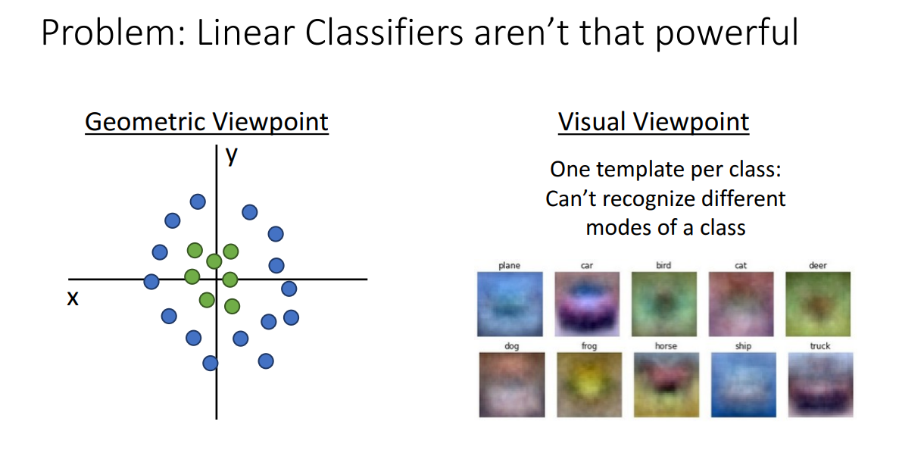

# 5강 - Neural Networks

# 키워드

- 신경망(Neural Networks), 이미지 분류, 선형 분류기, 비선형성(Non-linearity), 활성화 함수(Activation Function), 계층(Layers), 입력 계층(Input Layer), 은닉 계층(Hidden Layers), 출력 계층(Output Layer), 뉴런(Neurons), 딥러닝(Deep Learning), 시그모이드(Sigmoid), 포화(Saturation), 기울기 소실(Vanishing Gradient), 출력값의 중심이 0이 아님, ReLU(Rectified Linear Unit), 계산 효율성, 죽은 ReLU(Dying ReLU), 희소성(Sparsity), Leaky ReLU, ELU(Exponential Linear Unit), Maxout, 다층 퍼셉트론(Multi-layer Perceptron, MLP), 완전히 연결된 계층(Fully-connected Layers), 깊이(Depth), 너비(Width), 역전파(Backpropagation).

# Traditional Computer Vision

## Problem of Linear Classifier



- 기하학적 관점으로 봤을 때 데이터 분포가 비선형이면 선형 분류기로는 해결할 수 없다
- 시각화 관점으로 봤을 때 하나의 클래스마다 하나의 템플릿으로 데이터셋의 이미지 전부를 표현해야 하기 때문에 여러 모드들을 인식하기에 적합하지 않다
    - 예시로 말 템플릿 경우 말 머리가 2개다
- 모드: 분포 그래프에서 골짜기에 해당하는 부분. 이미지를 각 픽셀 값들에 대한 확률 분포로 표현한다 했을 때 같은 클래스라도 말이 왼쪽 바라보거나 오른쪽 바라보는 이미지에 대한 모드가 각각 존재함


- 원래 데이터 분포에서 극좌표계로 변환하면 선형으로 분리할 수 있는 여지가 생긴다 → 특징 변환
→ 은닉층의 활성화 함수의 역할

## Image Features

### Color Histogram


- 이미지 내에서 각 색상마다 몇 번 사용되었는지 표현
- 이미지의 전체적인 색감 분포를 기준으로 이미지를 분류, 검색, 혹은 비교하기 위해 만든다
    - 검색: 숲 사진 찾고 싶다면 초록색 영역의 빈도 수가 높은 히스토그램을 가진 이미지들을 검색하면 유사한 이미지를 빠르게 찾아낼 수 있다
- 공간 정보를 무시하고 오로지 색상 개수로만 가지고 그래프를 만든다
→ 이미지가 회전하거나 이동해도 히스토그램 값이 크게 변하기 않기 때문에 강건성이 있다
- 단점으로는 픽셀을 무작위로 섞은 노이즈 이미지와 원본 이미지의 히스토그램이 똑같을 수도 있다
→ 모양이나 질감 정보가 사라진다

### HoG (Histogram of Oriented Gradients)


- 이미지 각 픽셀 위치마다 기울기를 구해서 나타낸 히스토그램을 HoG라고 한다
- 기울기는 곧 해당 픽셀 위치에서의 엣지 방향과 같다

### Bag of Words


## 성공했었던 방식


# Neural Networks

## Machine Learning vs. Neural Networks


- 머신러닝 기법에서는 이미지가 주어지면 특징 추출까지 사람이 진행한 다음 f를 training 하는 거였다
- 뉴럴 네트워크에서는 오로지 이미지만 입력으로 주면 모델이 특징 추출부터 score 뽑는 함수까지 한 번에 진행하여 training 또한 이 모든 것들을 대상으로 진행한다

## MLP


- 단일 퍼셉트론을 여러 개 쌓은 것이 MLP
- Hidden layer 100개로 설정했으므로 x로부터 추출하는 특징 개수 또한 100개


- 첫 번째 레이어에는 100개만큼의 템플릿이 존재함
- 하나의 클래스에 대해 여러 개의 템플릿을 만들 수 있기 때문에 말 같은 경우에도 다양한 모드에 대해 잘 처리가 가능함
- 추출하는 특징이 많아짐에 따라 이게 무엇을 포착하려는 템플릿인지 설명 불가능한 것들도 존재함
- 두 번째 레이어는 템플릿들의 유사 정도를 기반으로 10 class 중 하나로 분류하는 역할

## Activation Functions


- 레이어를 깊게 쌓으면 그게 deep neural networks
- 깊게 쌓을수록 그만큼 추상화의 수준이 더 높아진다 → 클래스를 분류하기 위한 최소한의 특징만 남김
    - ex) 우리가 졸라맨만 그려도 사람이라는 것을 알 수 있다. 졸라맨은 사람을 추상화한 그림


- 중간 중간에 비선형 함수를 추가하는 것이 중요한 이유
    - 선형 연산에 선형 연산은 그저 새로운 하나의 선형 연산과 같다
    - 따라서 선형 이후 비선형이 따라와야 한다
    - 딥러닝 모델은 결국 선형-비선형의 반복! fc, cnn, rnn, transformer 전부 선형-비선형의 반복!


- ReLU가 대부분의 task에 적합한 활성화 함수이다
    - 양수에 대해 기울기가 1이므로 기울기 소실 발생 X
    - 연산도 간단해서 하드웨어적으로도 복잡성 낮음


```python
import numpy as np
from numpy.random import random

'''
input: 64개 샘플 x 1개 샘플 당 1000개 특징, [64, 1000]
w1: [1000, 100]
hidden layer: 100
w2: [100, 10]
output: 10

h = sigmoid(input * w1), [64, 100]
y_pred = h * w2, [64, 10]
loss = 오차제곱의 합 = (y_pred - y)^2.sum()
dl/dy_pred = 2 * (y_pred - y)
dl/dw2 = dy_pred/dw2 * dl/dy_pred = h * dl/dy_pred
dl/dh = dy_pred/dh * dl/dy_pred = w2 * dl/dy_pred
dl/dw1 = dh/dw1 * dl/dh = input * h * (1 - h) * dl/dh
'''
N, Din, H, Dout = 64, 1000, 100, 10
x, y = randn(N, Din), randn(N, Dout)
w1, w2 = randn(Din, H), randn(H, Dout)
for t in range(10000):
	// 활성화 함수는 Sigmoid
	h = 1.0 / (1.0 + np.exp(-x.dot(w1)))
	// 출력층으로 갈 때는 활성화 함수가 없음 -> logit
	y_pred = h.dot(w2)
	// Loss function은 오차제곱의 합 -> L2 Loss
	loss = np.square(y_pred - y).sum()
	// dL/dy_pred
	dy_pred = 2.0 * (y_pred - y)
	// dL/dw2 = dy_pred/dw2 * dL/dy_pred = h * dL/dy_pred
	dw2 = h.T.dot(dy_pred)
	// dL/dh = dy_pred/dh * dL/dy_pred = w2 * dL/dy_pred
	dh = dy_pred.dot(w2.T)
	// dL/dw1 = dh/dw1 * dL/dh = input * h * (1 - h) * dL/dh
	dw1 = x.T.dot(dh * h * (1 - h))
	// w := w - alpha dL/dw
	w1 -= 1e-4 * dw1
	w2 -= 1e-4 * dw2
```

## 뉴럴 네트워크와 뇌 뉴런과의 연관성

### Biological Neuron


- **Dendrite** (수상돌기): 다른 뉴런으로부터 전기적 신호(Impulse)를 받아 세포체(Cell Body) 쪽으로 전달하는 역할을 합니다.
- **Cell Body** (세포체): 수상돌기로부터 들어온 신호를 통합하고 처리하는 중심 부분입니다.
- **Axon** (축색돌기): 세포체에서 처리된 신호를 다른 뉴런으로 전달하기 위해 뻗어 나가는 돌기입니다. 신호는 세포체에서 멀어지는 방향으로 이동합니다.
- **Synapse** (시냅스) / **Presynaptic Terminal**: 한 뉴런의 축색돌기 말단과 다른 뉴런의 수상돌기 사이의 연결 부위로, 신호 전달이 일어나는 곳입니다.
- **Firing Rate**: 뉴런의 발화율은 입력 신호들에 대한 비선형 함수(Nonlinear Function)로 작동합니다

### Neural Network


- **입력 ($x_0, x_1, ...$)**: 생물학적 뉴런의 수상돌기(Dendrite)에 해당하며, 외부 데이터나 이전 층(layer)의 출력을 받아들입니다.
- **가중치 ($w_0, w_1, ...$)**: 생물학적 시냅스(Synapse)의 연결 강도를 모델링한 것입니다. 각 입력 신호는 이 가중치와 곱해져 ($w_i x_i$) 중요도가 조절됩니다.
- **세포체 (Summation & Bias)**: 입력 신호와 가중치의 곱을 모두 더하고 편향(Bias, $b$)을 더하는 연산 $\sum_i w_i x_i + b$ 이 수행됩니다. 이는 세포체(Cell Body)에서 신호를 통합하는 과정에 대응됩니다.
- **활성화 함수 (Activation Function, $f$)**: 합산된 신호에 비선형 함수 $f$ 를 적용하여 최종 출력 $f(\sum_i w_i x_i + b)$ 를 생성합니다. 이는 뉴런의 발화율(Firing Rate)을 모델링한 것으로, **ReLU** ($max(0, z)$), **Sigmoid**, **Tanh** 등이 사용됩니다.
- **출력 (Output)**: 활성화 함수를 거친 결과 값은 다음 층의 뉴런으로 전달됩니다. 이는 축색돌기(Axon)를 통한 신호 전달과 유사합니다.

### 구조적 차이점

- **연결 구조**: 생물학적 뉴런은 매우 복잡한 연결 패턴을 가지는 반면, 인공 신경망은 계산 효율성을 위해 규칙적인 층(Regular Layers) 구조(입력층, 은닉층, 출력층)로 조직화되어 있습니다.
- **복잡성**: 실제 생물학적 뉴런은 다양한 종류가 존재하며, 수상돌기는 복잡한 비선형 계산을 수행할 수 있습니다. 또한 시냅스는 단순한 가중치(Single Weight)가 아니라 복잡한 비선형 동적 시스템입니다.
- **학습 원리**: 인공 신경망은 주로 역전파(Backpropagation) 알고리즘을 통해 가중치를 학습하지만, 생물학적 뇌의 학습 메커니즘과는 차이가 있을 수 있습니다.
- 결론적으로 **Neural Network** 는 생물학적 신경망의 구조를 단순화하여 수학적으로 모사한 모델이며, 이를 통해 데이터의 특징을 변환(Space Warping)하고 복잡한 함수를 근사(Universal Approximation)하여 분류나 예측 같은 문제를 해결하는 알고리즘이다.

## Space Warping

## Universal Approximation