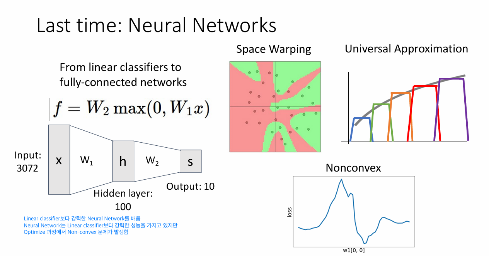

# 6강 - Backpropagation

# 키워드

- 역전파(Backpropagation), 신경망(Neural Networks), 손실 함수(Loss Function), 기울기(Gradient), 최적화(Optimization), 경사 하강법(Gradient Descent), 수치적 기울기(Numeric Gradient), 해석적 기울기(Analytic Gradient), 체인 규칙(Chain Rule), 함수 합성, 순전파(Forward Pass), 역전파(Backward Pass), 지역적 기울기(Local Gradient), 덧셈 게이트, 곱셈 게이트, 최대값 게이트, 시그모이드 함수(Sigmoid Function), 기울기 소실(Vanishing Gradient), 행렬 곱셈, 벡터화된 연산, 단계별 역전파(Staged Backpropagation), 메모리 관리, 수치적 기울기 확인(Gradient Checking), 상대 오차, 중앙 차분 공식, 플로팅 포인트 정밀도, 특이점, 정규화.

# Last time: Neural Networks



- Nerual Networks는 Linear classifier보다 강력하다
- Optimize 과정에서 Nonconvex 문제가 발생함


- 어떻게 gradient를 계산할 것인가? → Backpropagation

# How to compute gradients

## (Bad) Idea: Derive $\nabla_wL$ on paper

- $\nabla_wL$을 직접 종이에 계산
- 문제점
    - 굉장히 비효율적: 많은 연산과 많은 종이가 필요하다
    - 만약 loss function을 바꾸고 싶다면? 처음부터 다시 계산해야 한다 → Not modular!
    - 굉장히 복잡한 모델에서는 적합하지 않은 방식임

## Better Idea: Computational Graphs

- loss 계산 과정을 작은 연산 단위로 쪼개서 노드로 연결한 그래프


- AlexNet이나 Neural Turing Machine 또한 Computational Graph 형태로 구성되어 있음

# Backpropagation

## Simple Example


- Forward pass 순전파
    - output을 계산하는 과정
- Backward pass 역전파
    - 기울기를 계산하는 과정
    - 우리는 output function f에 대해서 input 값 x, y, z의 기울기를 구하고 싶다
    → x, y, z가 각각 f에 얼마나 영향을 주는지 알고 싶다
    - 처음에는 자기 자신부터 시작함. $\frac{\partial f}{\partial f}$은 무조건 1임 → Base case
    - 이후에는 각 노드마다 Chain Rule을 사용하여 기울기 계산해서 전달한다
    - Chain Rule
        - $\begin{aligned}
        y &= f(g(x)) \\
        y' &= f'(g(x)) \cdot g'(x) \\
        &= \frac{df}{dg(x)} \cdot \frac {dg(x)}{dx}
        \end{aligned}$


- $\frac{\partial f}{\partial z} = q = 3$
- $\frac{\partial f}{\partial q} = z = -4$
- $\frac{\partial f}{\partial y} = \frac{\partial q}{\partial y} \frac{\partial f}{\partial q} = 1 \cdot -4 = -4$
- $\frac{\partial f}{\partial x} = \frac{\partial q}{\partial x} \frac{\partial f}{\partial q} = 1 \cdot -4 = -4$
- Downstream Gradient: 해당 입력 값에 대한 전체 함수의 기울기
- Local Gradient: 해당 입력 값과 직접적으로 연결된 함수의 기울기
- Upstream Gradient: 이전 단계로부터 전달되어진 기울기


- 현재 입력 값이 전체 output에 미치는 영향 = 현재 입력 값이 만든 함수에 대한 영향 X 그 함수가 전체 output에 미친 영향

## Another Example


- Simple Example과 마찬가지로 Chain Rule을 사용해서 계산 가능하다


- 여러 개의 노드들을 하나의 연산으로 합쳐서 계산해도 동일하게 진행됨
- 파란색 박스 내에 있는 연산들은 Sigmoid 함수로 표현됨
    - Sigmoid 함수를 미분해서 진행했을 때도 똑같이 값이 나옴을 확인할 수 있음
    - Sigmoid 함수의 장점은 함수 값만 가지고 gradient 계산이 된다는 점이다

## Patterns in Gradient Flow


- add gate: Upstream gradient 값을 그대로 전달한다
    - $f = g(z); \; z = x + y \\
    \frac{\partial f}{\partial x} = \frac{\partial z}{\partial x} \frac{\partial f}{\partial z} = 1 \cdot \frac{\partial f}{\partial z} \\
    \frac{\partial f}{\partial y} = \frac{\partial z}{\partial y} \frac{\partial f}{\partial z} = 1 \cdot \frac{\partial f}{\partial z}$
- mul gate: 서로의 Local gradient를 Upstream gradient와 곱해서 swap 한다
    - $f = g(z); \; z = x \times y \\
    \frac{\partial f}{\partial x} = \frac{\partial z}{\partial x} \frac{\partial f}{\partial z} = y \cdot \frac{\partial f}{\partial z} \\
    \frac{\partial f}{\partial y} = \frac{\partial z}{\partial y} \frac{\partial f}{\partial z} = x \cdot \frac{\partial f}{\partial z}$
- copy gate: Upstream gradient를 더한다
    
    
    
    - 대표적인 예시로 w를 loss 계산과 regularization 둘 다 보낼 때 사용한다
    - 또 다른 예시로 RNN의 BPTT
- max gate: Upstream gradient는 최댓값으로 선택된 경로에만 전달 된다

### Q. 강의에선 mul gate 는 forward pass 일 때와 backward pass 일 때 모두 곱하기 연산이 일어나서 mul gate를 많이 갖고 있는 모델일 때, 문제가 될 수 있는 모델이 있을 수 있다고 하는 데, 어떤 모델이, 왜 문제가 되는 걸까?

- RNN의 구조는 다음과 같다
    - 은닉층: $h_t = tanh(W_hh_{t-1} + W_xx_t + b)$
    출력층: $y_t = f(W_yh_t + b) \; 단, f는 \; 비선형 \; 함수$
    - t 시점으로부터 t-1 시점까지 기울기를 전달한다고 하면 $\frac{\partial h_t}{\partial h_{t-1}} = tanh'(...) * W_h$ 이므로, 이를 계속 역전파 진행한다면 $W_h$가 계속 곱해지게 된다
    - $W_h$의 고윳값이 1보다 작다면 계속 곱해질수록 0으로 수렴하게 된다. 즉, 먼 과거의 정보가 현재의 loss에 영향을 주지 못한다는 문제 → Vanishing Gradient
    - $W_h$의 고윳값이 1보다 크다면 계속 곱해질수록 무한대로 발산하게 된다. 즉, 가중치 업데이트를 극단적으로 만들어 학습을 불안정하게 하고 결국 모델이 망가진다는 문제 → Exploding Gradient

### Q. 강의에선 max gate를 많이 갖고 있는 모델은, backpropagation을 할 때 gradient가 0이 되는 경우가 많아지므로 good gradient flow 를 얻기가 어려워지는 문제가 생겨 max gate를 선호하지는 않게 된다고 한다. 이것이 leaky Relu와 관련이 있는 걸까?

- max gate의 대표적인 예시는 $ReLU = max(0, x)$ 함수
- 역전파 시 gradient가 0이 되는 뉴런들이 많아진다
→ 그 뉴런들은 gradient가 흐르지 않게 되므로 네트워크 학습 시 업데이트 되지 않는다
→ 죽은 뉴런 문제
- 한번 비활성화 된 뉴런은 영원히 죽어버려, 네트워크의 용량(capacity)을 감소 시키고 학습을 방해한다
→ good gradient flow를 얻기가 어려워진다
→ 즉, gradient flow가 중간에 뚝뚝 끊긴다
- 해결책: $Leaky\;ReLU = max(\alpha x, x), \; \alpha$는 0.01과 같은 매우 작은 양수
    - 역전파 시 0으로 만들지 않고 아주 작은 값($\alpha$)이라도 살려서 전달함
    → 뉴런이 완전히 죽는 것을 방지함
    → gradient flow가 끊기지 않게 도와줌

## Backpropagation 과정을 Code로 구현

### Flat Gradient Code


- Forward pass 부분의 코드를 역으로 진행하는 코드로 구현하는 방식
- add gate는 upstream gradient를 복사해서 전달되고, mul gate는 input 값을 서로 바꿔서 upstream gradient와 곱한 값으로 전달 됨을 확인할 수 있음
- 모델을 바꾸거나 활성화 함수, loss function 등 다른 것으로 바뀌어버리면 그에 따라서 코드도 다시 작성해야 한다는 비효율성이 있음

### Modular API


- x, y, z가 스칼라일 때 mul gate에 대해서 위와 같이 구현할 수 있음
- @staticmethod
    - 클래스 내에서 정적 메소드로 함수를 구현할 때 사용하는 데코레이터
    - 정적 메소드: 클래스 내의 인스턴스에 접근하지 않고 결과만 구하는 메소드
        - 그래서 self가 필요 없다
- ctx
    - backward 과정에서 사용하기 위한 임의의 값을 저장할 때 사용


- Pytorch에서 Sigmoid layer가 구현된 모습
- forward와 backward가 각각 구현된 모습을 확인할 수 있음

# Vector Derivatives


- input x: 스칼라, output y: 스칼라
    - 미분 값: 스칼라
- input x: N 크기 벡터, output y: 스칼라
    - 미분 값: N 크기 벡터
- input x: N 크기 벡터, output y: M 크기 벡터
    - 미분 값: NxM 크기 행렬 → Jacobian(야코비안) 행렬
        
        
        

## Backpropagation with Vectors


- $L \in \mathbb{R}$, $z \in \mathbb{R}^z$
    - Loss 값 L은 여전히 스칼라이고, z는 벡터라고 한다면
    - $\frac{\partial L}{\partial z} \in \mathbb R^z$
- $x \in \mathbb R^x$, $y \in \mathbb R^y$
    - input이 벡터이고, output도 벡터이므로 기울기는 Jacobian 행렬로 나타난다
    - $\frac{\partial z}{\partial x} \in \mathbb R^{x\times z}$, $\frac{\partial z}{\partial y} \in \mathbb R^{y \times z}$
- **따라서 $\frac{\partial L}{\partial x}$, $\frac{\partial L}{\partial y}$의 크기는 각각 x, y의 크기와 같다**
    - $\frac{\partial L}{\partial x} = \frac{\partial z}{\partial x}\frac{\partial L}{\partial z} = [D_x \times D_z] \cdot [D_z \times 1] = [D_x \times 1]$
    - $\frac{\partial L}{\partial y} = \frac{\partial z}{\partial x}\frac{\partial L}{\partial z} = [D_y \times D_z] \cdot [D_z \times 1] = [D_y \times 1]$


- input과 output 모두 벡터이고, ReLU 함수를 원소별 연산으로 진행한다면
    - $dL/dy$는 주어졌다고 가정
    - $dy/dx$는 대각 행렬로 나타난다
        - 원소별 연산이기 때문에 $x_1$은 $y_1$에만 영향을 주고 $y_2$, $y_3$, $y_4$에는 관련이 없다
        - max gate는 선택되어진 input 값으로만 기울기를 전달하고, 나머지는 0을 전달함
        → 따라서 음의 값인 $x_2$, $x_4$는 기울기가 0임
- ReLU 함수일 때 $dy/dx$는 희소 행렬로 나타난다
    - 희소 행렬: 원소 값이 대부분 0인 행렬
    - 벡터의 차원이 커질수록 Jacobian 행렬의 크기 또한 매우 커져서 연산량이 많아짐
    → 하지만 대부분의 값이 0이기 때문에 굉장히 비효율적임
    → 명시적으로 Jacobian 행렬을 만들지 않고 진행한다


- Downstream gradient를 x가 양수일 때는 upstream gradient 곱해주고, x가 음수면 0으로 정의
- 희소성의 장점
    - 대부분 0이므로 곱셈 생략 가능
    - 일부 뉴런만 활성화 함으로써 과적합 방지
- 희소성의 단점
    - x가 음수인 뉴런에 대해서는 gradient가 전달이 되지 않고 죽어버림
    → 학습 불가능함
    → 죽은 뉴런 문제

### Q. 사람들은 왜 죽은 뉴런 문제를 감수하면서 까지 ReLU를 Leaky ReLU보다 더 많이 사용할까?

- Leaky ReLU가 죽은 뉴런 문제를 해결하는 훌륭한 대안인 것은 맞지만, ReLU는 단순성, 계산 속도, 그리고 희소성이 주는 이점이라는 강력한 무기를 가지고 있습니다. 또한, 수많은 실제 사례에서 "충분히 좋은" 성능을 보여주기 때문에 굳이 하이퍼 파라미터 튜닝의 부담을 감수하면서 까지 Leaky ReLU로 바꿀 필요가 없는 경우가 많습니다.
- 희소성이 주는 이점
    - 계산 효율성: 0인 뉴런은 다음 레이어의 계산에 영향을 주지 않으므로 생략 가능
    - 정보의 분리: 특정 입력에 대해 특정 뉴런만 활성화 되니까 더 의미 있는 특성(feature)을 학습하는데 도움이 된다
    - 규제(Regularization): 일부 뉴런을 강제로 비활성화 시킴으로써 과적합(overfitting)을 방지함

## Backpropagation with Matrices (or Tensors)


- Vectors 때와 마찬가지로 $\frac{\partial L}{\partial x}$, $\frac{\partial L}{\partial y}$의 크기는 각각 x, y의 크기와 동일하다


- 명시적으로 Jacobian 행렬을 표현하기에는 크기가 너무 크다
→ Vectors 때와 마찬가지로 암묵적으로 진행할 것이다


- $dy/dx_{1,1} = 
\begin{aligned}
[&[\frac{dy_{1,1}} {dx_{1,1}},\;\frac{dy_{1,2}}{dx_{1,1}},\;\frac{dy_{1,3}}{dx_{1,1}},\;\frac{dy_{1,4}}{dx_{1,1}}]\\&[\frac{dy_{2,1}}{dx_{1,1}},\;\frac{dy_{2,2}}{dx_{1,1}},\;\frac{dy_{2,3}}{dx_{1,1}},\;\frac{dy_{2,4}}{dx_{1,1}}]]
\end{aligned}
=
\begin{aligned} 
[&[&w_{1,1}&,&w_{1,2}&,&w_{1,3}&,&w_{1,4}&]\\
&[&0&,&0&,&0&,&0&]]
\end{aligned}$
    - $\frac{dy_{1,1}}{dx_{1,1}} = \frac{d(x_{1,1}w_{1,1}+x_{1,2}w_{2,1}+x_{1,3}w_{3,1})}{dx_{1,1}} = w_{1,1}$
    - $\frac{dy_{2,1}}{dx_{1,1}} = \frac{d(x_{2,1}w_{1,1}+x_{2,2}w_{2,1}+x_{2,3}w_{3,1})}{dx_{1,1}}=0$


- $dy/dx_{2,3}$에 대해서도 마찬가지이다


- 따라서 위와 같이 $dL/dx$, $dL/dw$를 구할 수 있음
- **즉, shape가 맞도록 transpose를 적절히 수행하면 쉽게 구할 수 있음**

# Another View

## Reverse-Mode Automatic Differentiation


- input은 벡터이고, output은 스칼라(L)인 상황
- 각 편미분 항은 모두 Jacobian 행렬이지만, L 값은 스칼라이기 때문에 마지막 항은 벡터이다
- Chain rule을 가지고 다음의 식으로 역전파를 할 수 있다
    - 오른쪽→왼쪽 순으로 계산을 진행한다면
    - $\frac{\partial x_3}{\partial x_2} \cdot \frac{\partial L}{\partial x_3} = [D_2 \times D_3] \cdot [D_3 \times 1] = [D_2 \times 1]$
    - $\frac{\partial x_2}{\partial x_1} \cdot (\frac{\partial x_3}{\partial x_2} \cdot \frac{\partial L}{\partial x_3}) = [D_1 \times D_2] \cdot [D_2 \times 1] = [D_1 \times 1]$
    - $\frac{\partial x_1}{\partial x_0}\cdot (\frac{\partial x_2}{\partial x_1} \cdot \frac{\partial x_3}{\partial x_2} \cdot \frac{\partial L}{\partial x_3}) = [D_0 \times D_1] \cdot [D_1 \times 1] = [D_0 \times 1]$
    - 이렇게 행렬*행렬 연산을 피하고 행렬*벡터 연산만으로 수행이 가능하다
    → 고차원 Jacobin 행렬을 저장하지 않아도 됨
    → 매우 효율적
- 왜 딥러닝에 최적인가?
    - 출력(손실) L이 스칼라이기 때문에 “벡터→행렬”이 아니라 “벡터→벡터” 역전파만 반복
    - 입력 차원이 매우 크더라도(수백만 파라미터) 각 단계에서 행렬‑벡터 곱만 수행
    - 그래서 역전파(reverse-mode AD)가 PyTorch·TensorFlow 같은 프레임워크의 기본 자동 미분 엔진

## Forward-Mode Automatic Differentiation


- 만약 input이 스칼라이고, output이 벡터인 상황에서 gradient를 구한다면?
    - 왼쪽→오른쪽 순으로 계산을 진행한다면
    - $\frac{\partial x_0}{\partial a} \cdot \frac{\partial x_1}{\partial x_0} = [1\times D_0] \cdot [D_0 \times D_1] = [1 \times D_1]$
    - $(\frac{\partial x_0}{\partial a} \cdot \frac{\partial x_1}{\partial x_0}) \cdot \frac{\partial x_2}{\partial x_1} = [1\times D_1] \cdot [D_1 \times D_2] = [1 \times D_2]$
    - $(\frac{\partial x_0}{\partial a} \cdot \frac{\partial x_1}{\partial x_0} \cdot \frac{\partial x_2}{\partial x_1}) \cdot \frac{\partial x_3}{\partial x_2} = [1\times D_2] \cdot [D_2 \times D_3] = [1 \times D_3]$
    - 마찬가지로 행렬*행렬 연산을 피하고 행렬*벡터 연산만으로 수행이 가능하다
    - input이 스칼라이고, output이 벡터인 상황에서 효율적임
- 왜 잘 안 쓰나?
    - 딥러닝(특히 손실함수 계산)은 보통 “벡터 입력 → 스칼라 출력” 구조
    - forward-mode를 쓰면 입력 차원(수백만)에 대해 각 차원마다 한 번씩 forward‑mode AD 를 돌려야 함
    - 계산량이 기하급수적으로 늘어나서 사실상 역전파가 훨씬 효율적
- Forward‑Mode를 역전파로 흉내 내기
    - “역전파 엔진”을 두 번 호출해 forward-mode AD 를 구현할 수 있음
        1. 첫 번째 역전파로 $\frac{∂L}{∂θ}$ 를 구하고
        2. 두 번째 역전파로 각 파라미터 변화가 출력에 미치는 영향을 추적
    - 비효율적이지만, 수학적으로 “행렬‑벡터 곱만” 사용한다는 점에서 우아한 방식이기도 함
- **1. 생성 모델에서의 잠재 변수 보간 (Latent Interpolation)**
GAN 이나 VAE 같은 생성 모델에서 특정 ** 스타일 ** 이나 ** 속성 ** 을 제어할 때 발생한다.
• ** 상황: ** 이미지의 미소 정도나 밝기를 조절하는 단일 잠재 변수 $z_i$ (Scalar) 를 변화시킨다.
• ** 구조: ** 이 ** 스칼라 ** 값이 변함에 따라 생성되는 전체 이미지 (Matrix) 가 어떻게 변하는지 관찰한다.
• ** 미분: ** $\frac{\partial \text{Image}}{\partial z_i}$ 를 계산할 때, 입력은 1개인데 출력은 수만 개의 픽셀이므로 전방 모드 AD 가 효율적이다.
**2. 로보틱스의 궤적 생성 (Trajectory Generation)**
로봇 팔의 움직임을 제어하는 제어기 설계 시 필수적인 구조이다.
• ** 상황: ** 입력으로 시간 $t$ (Scalar) 가 들어간다.
• ** 구조: ** 출력으로 로봇의 각 관절 각도 $q(t)$ (Vector) 혹은 관절의 자코비안 행렬 (Matrix) 이 도출된다.
• ** 미분: ** 시간에 따른 관절 위치의 변화량 (속도) 이나 가속도를 구할 때 $t$ 에 대한 미분이 수행된다.
**3. 내재적 신경 표현 (Implicit Neural Representations, INR)**
최근 NeRF (Neural Radiance Fields) 와 같은 분야에서 널리 쓰이는 방식이다.
• ** 상황: ** 공간 상의 한 좌표 (예: 광선을 따라가는 거리 $d$) 를 입력으로 넣는다.
• ** 구조: ** 해당 지점에서의 색상 (RGB Vector) 이나 밀도, 혹은 법선 벡터 (Normal Vector) 를 출력한다.
• ** 미분: ** 특정 지점에서의 밀도 변화율을 통해 물리적 효과를 계산할 때 스칼라 입력에 대한 벡터 미분이 일어난다.
**4. 하이퍼파라미터 제어 및 메타 러닝**
모델의 가중치 전체를 조절하는 단일 파라미터가 있는 경우이다.
• ** 상황: ** 가중치 감쇠 (Weight Decay) 계수나 학습률 (Learning Rate) $\eta$ (Scalar) 를 입력으로 본다.
• ** 구조: ** 이 값에 의해 최종적으로 결정되는 모델의 전체 가중치 행렬 $W$ (Matrix) 의 변화를 추적한다.
• ** 미분: ** 하이퍼파라미터가 모델 파라미터들에 미치는 영향을 분석하여 최적의 값을 찾을 때 사용된다.

# Higher-Order Derivatives


- $\frac{\partial^2L}{\partial x^2_0}$: Hessian matrix로 2차 도함수에 대한 정보, 곡률에 대한 정보를 담고 있는 행렬임
- 만약 벡터 v가 $x_0$에 의존하지 않는다면 $\\
\frac{\partial^2L}{\partial x^2_0} v = \frac{\partial}{\partial x_0}[\frac{\partial L}{\partial x_0} \cdot v] = D_0 \times[[1 \times D_0] \cdot [D_0 \times 1]] = [D_0 \times 1]$
- **즉, 역전파 2번을 통해 구할 수 있다**


- WGAN-GP (Wasserstein GAN with Gradient Penalty) 의 핵심은 판별자 (Critic) 의 그래디언트 노름 (Norm) 을 1로 강제하여 립시츠 (Lipschitz) 제약 조건을 충족시키는 것이다.
- 예시로 Regularization으로 norm을 가지고 했을 때 이를 역전파 하는 과정에서 Hessian matrix 사용됨
    - 이 과정에서 $\mathbf H \cdot v$ 형태가 되고, 위와 같이 조건(v가 $x_0$에 의존하지 않는다면)이 성립한다면 Hessian matrix 저장할 필요 없이 메모리 효율적으로 연산 수행할 수 있음
    - $\frac{\partial L}{\partial x_0}$가 $x_0$에 의존하지 않는다?
        - 가령 $\frac{\partial L}{\partial x_0}$에서 $x_0$가 없다면 이는 $x_0$에 의존하지 않는다고 할 수 있음
        - 선형 모델이라면 가장 간단하게 $L = w \cdot x_0 - y_{label}$라고 했을 때,
        $\frac{\partial L}{\partial x_0} = w$이므로 $x_0$에 의존하지 않음
- WGAN-GP 그래디언트 패널티 구현 코드
    
    ```python
    import torch
    import torch.autograd as autograd
    
    def compute_gradient_penalty(D, real_samples, fake_samples):
        """WGAN-GP의 Gradient Penalty를 계산하는 함수이다."""
        
        # 1. 무작위 보간 (Interpolation) 데이터 생성
        alpha = torch.rand(real_samples.size(0), 1, 1, 1).to(real_samples.device)
        interpolates = (alpha * real_samples + ((1 - alpha) * fake_samples)).requires_grad_(True)
        
        # 2. 보간된 데이터에 대한 판별자의 출력 계산
        d_interpolates = D(interpolates)
        
        # 3. 역전파를 위한 가상의 그래디언트 (v) 생성
        fake = torch.ones(d_interpolates.shape).to(real_samples.device)
        
        # 4. 1차 역전파 수행 및 연산 그래프 유지 (create_graph=True)
        # 이것이 이미지에서 설명한 '1차 역전파 연산 그래프'를 구축하는 단계이다.
        gradients = autograd.grad(
            outputs=d_interpolates,
            inputs=interpolates,
            grad_outputs=fake,
            create_graph=True,      # 2차 미분을 위해 그래프를 유지한다
            retain_graph=True,
            only_inputs=True,
        )[0]
        
        # 5. 그래디언트 노름 계산
        gradients = gradients.view(gradients.size(0), -1)
        gradient_norm = gradients.norm(2, dim=1)
        
        # 6. 패널티 계산: (노름 - 1)^2 의 평균
        gradient_penalty = ((gradient_norm - 1) ** 2).mean()
        
        return gradient_penalty
        '''
        위 함수에서 반환된 gradient_penalty를 전체 loss 에 더한 뒤
        loss.backward()를 최종 호출하면, 보존되어 있던 1차 미분 그래프를 타고
        2차 미분(Double Backprop)이 수행된다.
        결과적으로 이는 해시안-벡터 곱(Hessian-vector product) 형태로
        파라미터 업데이트에 반영된다.
        '''
    ```
    

# Summary


- Backpropagation을 코드로 구현할 때
    - 순전파 과정을 반대로 진행하는 방식으로 구현 → flat code
    - forward, backward 메소드를 직접 구현 → modular API


- 우리는 지금까지 Linear Classifier에 대해서 배웠다
- 문제점
    - image 데이터를 하나의 벡터로 flatten 해서 진행했었다
    - image 데이터의 각 value에 해당하는 공간적인 구조를 전혀 존중하지 않고 있다!
    → Convolutional Neural Networks로 공간적인 구조를 존중하고자 한다