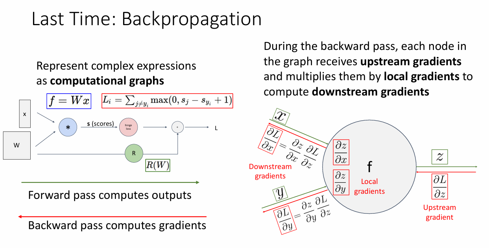

# 7강 - Convolutional Neural Networks

# 키워드

- 합성곱 신경망, 합성곱 계층, 필터, 커널, 특징 맵, 편향, 패딩, 스트라이드, 수용장, 1x1 합성곱, 활성화 함수, ReLU, 풀링 계층, 최대 풀링, 평균 풀링, 배치 정규화, 계층 정규화, 인스턴스 정규화, 그룹 정규화, 완전 연결 계층, LeNet-5

# Last Time: Backpropagation

- 복잡한 연산 과정을 computational graphs를 통해 표현한다
    - Forward pass를 통해 outputs를 계산한다
    - Backward pass를 통해 gradients를 계산한다
- 그래프의 각 노드에서는 upstream gradients를 받아서 local gradients와 곱함으로써 downstream gradients를 구한다

- Fully Connected Nerual Network는 input을 flatten으로 준다
→ 이미지 데이터조차 flatten해서 입력으로 진행하기 때문에, 이미지의 공간적 정보(픽셀의 위치 등)가 손실되는 문제 발생
→ 각 픽셀이 주변 픽셀과 어떤 관계가 있는지 알지 못함
→ 이미지의 패턴을 인식하기 어려워짐
- 해결책: 이미지에 맞는 새로운 연산 노드를 정의하자

# Components of a Fully-Connected Network

- Fully-Connected Network 구성 요소
    - Fully-Connected Layers
        - FCNN의 각 계층(Layer)은 여러 개의 뉴런(Neuron)으로 구성됩니다. 입력 계층의 각 뉴런은
        입력 데이터의 각 특징(feature) 하나하나에 해당합니다. 예를 들어, 100개의 특징을 가진 데이터라면 입력 계층에는 100개의 뉴런이 필요합니다. 그리고 이 입력 계층의 모든 뉴런은 그 다음 은닉 계층(Hidden Layer)의 모든 뉴런과 연결됩니다.
        - 1차원 벡터로 구성된 input만 가능함
            - 뉴런의 계산은 기본적으로 가중치 합(Weighted Sum)과 활성화 함수로 이루어집니다. 입력 벡터 x와 가중치 행렬 W 사이의 행렬 곱셈(W * x) 연산을 통해 다음 계층으로 신호가 전달됩니다. 이 행렬 곱셈 연산이 성립하려면 입력 x는 반드시 1차원 벡터 형태여야 합니다.
    - Activation Function
        - FCNN에서는 단순 선형 변환 뿐만 아니라 비선형 변환도 필요
            - 여러 층을 쌓아도 그 층이 전부 선형 변환이라면 결국 하나의 큰 선형 변환과 동일함
            → 100개의 층을 쌓아도 결국 비선형성이 없으면 1개 층을 사용하는 것과 같아짐
            → 여러 개의 층을 쌓는 의미가 없어짐
            - XOR 분류와 같이 선형적으로 해결할 수 없는 문제는 비선형성이 필요함
                - 비선형 함수를 통해 표현력을 증대 시킬 수 있음
                - 층을 통과할 때마다 데이터 공간을 비선형적으로 휘거나 접을 수 있게 됨
                → 선형으로 나눌 수 없던 데이터 분포를 구분해내는 결정 경계를 만들 수 있음
                - 얕은 층에서는 선, 경계 등 단순한 특징을 학습하지만, 깊은 층으로 갈 수록 눈, 코, 입과 같이 더 복잡하고 추상적인 특징을 학습할 수 있게 됨

# Components of a Convolutional Network

- Convolutional Neural Network의 구성 요소
    - Convolution Layers
    - Pooling Layers
    - Normalization

## Convolution Layers

- 이미지의 특징
    - 지역성 → 필터 3x3 5x5 depth는 동일하게
    - 정장성 → 필터 가중치 공유: 동일한 특징을 포착하겠다
- Convolution 연산은 다음과 같이 이루어집니다.
    1. 정렬: 입력 데이터의 특정 위치에 필터를 가져다 놓습니다. 이때 입력 데이터의 채널과 필터의 채널이 서로 정렬됩니다.
    2. 요소별 곱셈 (Element-wise Multiplication): 각 채널별로 같은 위치에 있는 값끼리 곱합니다. (입력 R채널 x 필터 R채널, 입력 G채널 x 필터 G채널, ...)
    3. 전체 합산 (Summation): 요소별 곱셈으로 나온 모든 결과값들을 전부 더합니다.
    4. 결과: 이 합산된 값이 출력 특징 맵(Output Feature Map)의 한 픽셀 값이 됩니다.
    - 이 과정에서 입력 데이터의 3개 채널 정보가 압축되어 출력 특징 맵의 1개 채널 값으로 변환됩니다.

### Q. 입력 이미지 채널 수와 필터 채널 수가 같아야 하는 이유

- 필터가 각 위치에서 입력 이미지의 전체 채널에 걸친 공간적/채널적 패턴(특정 색상, 질감 등)을 한번에 감지하기 위해서이다
    - 보통 컬러 이미지의 채널은 RGB로 3개임
    - 필터가 노란색을 감지하기 위해서는 RGB 3개의 채널을 모두 확인해서 감지해야 함
    - 만약 입력 이미지의 채널보다 적은 채널의 필터로 진행한다면 전체 채널에 따른 정보를 감지하기가 힘듬
    - 만약 입력 이미지의 채널보다 큰 채널의 필터로 진행한다면 요소별 곱셈 과정에서 존재하지 않는 입력 데이터의 채널에 대해서 계산하려고 하니까 오류가 발생

### Q. Bias 항이 미치는 영향

- Bias의 핵심 역할
    1. 평행 이동: 계산된 결과(가중치합)를 전체적으로 특정 값만큼 더하거나 빼서, 활성화 함수가 적용될 기준선을 옮깁니다.
        1. ReLU(x)는 x가 0을 기준으로 적용되는 함수이지만, ReLU(x + 0.5)는 x가 0보다 작은 -0.4이더라도 bias에 의해 적용된다. 즉, x가 -0.5를 기준으로 적용되는 함수이다.
        2. 따라서 ReLU(x + 0.5)는 ReLU(x)보다 왼쪽으로 이동하게 된다.
    2. 활성화 조절: 뉴런(필터)이 얼마나 쉽게 또는 어렵게 활성화될지(fire)를 조절하는 문턱(threshold) 역할을 합니다.
        1. ReLU(x + 0.5)는 x가 음수이더라도 활성화 될 수 있는 함수이다. 따라서 쉽게 활성화 된다.
        2. ReLU(x - 0.5)는 x가 양수이더라도 0.5를 넘지 않으면 비활성화 되는 함수이다. 따라서 더 까다롭게 활성화 된다.
    3. 표현력 증가: 모델이 원점에 얽매이지 않고, 데이터 공간 내에서 자유롭게 패턴을 학습할 수 있도록 하여 모델의 전반적인 성능과 유연성을 높입니다.
    4. **일종의 normalization 즉, Batch Norm 같이 분포를 이동 시키는 역할**
- Convolution Layer에서의 Bias의 역할
    - output = Activation_Function(Conv(input, filter) + bias) → 각 픽셀 위치마다 bias 덧셈, 활성화 함수 적용
    - Convolution Layer의 Bias는 "해당 필터가 감지하려는 특징이 이미지 전체적으로 얼마나 흔하게 나타나는지에 대한 기준"을 학습하게 됩니다.
    - 예시: '고양이 눈'을 감지하는 필터
        - Bias가 큰 양수일 경우:
            - 이 필터는 '고양이 눈'이라는 특징이 매우 흔하다고 판단하는 것과 같습니다.
            - 따라서 필터가 '고양이 눈'과 약간만 비슷한 패턴을 감지해도(가중치합이 조금 작아도), 큰 양수 Bias 덕분에 쉽게 활성화됩니다.
            - 결과적으로, 특징 맵의 전반적인 값이 커져서(밝아져서) 더 많은 부분이 활성화됩니다. 필터가 "낙관적"으로 특징을 찾는다고 볼 수 있습니다.
        - Bias가 큰 음수일 경우:
            - 이 필터는 '고양이 눈'이라는 특징이 매우 드물거나, 아주 명확할 때만 인정해야 한다고 판단하는 것과 같습니다.
            - 필터가 '고양이 눈'과 매우 유사한 패턴을 감지해서 가중치합이 꽤 크더라도, 큰 음수 Bias 때문에 활성화되지 않을 수 있습니다.
            - 결과적으로, 특징 맵의 전반적인 값이 작아져서(어두워져서) 정말 확실한 부분만 활성화됩니다. 필터가 "보수적" 또는 "회의적"으로 특징을 찾는다고 볼 수 있습니다.

### Q. 1x1 conv가 하는 역할

- [Network in Network](https://arxiv.org/pdf/1312.4400) 논문에서 처음 제시됨
- 핵심 역할은 공간적 차원은 유지하되, 채널(Channel) 방향의 정보를 융합하고 그 개수를 조절하는 것입니다. 가장 직관적인 비유는 "각 픽셀 위치에서 독립적으로 동작하는 작은 완전 연결 계층(Fully-Connected Layer)"이라고 생각하는 것입니다.
- 차원을 줄인다 → 연산량 줄어들어 효율적이게 된다
- 차원을 늘린다 → 연산을 수행함에 있어서 차원을 맞춰줘야 할 때 1x1 conv를 통해서 차원을 맞춰 줄 수 있다. 이 때 주로 사용되는 것 같음

### Q. 1x1 conv가 FCNN과 다른게 무엇인가? 각 픽셀마다 가중치 곱하는게 FCNN과 같은거 아닌가?

- 입력 이미지와 똑같은 크기의 conv는 FCNN과 같다
    - FCNN에 들어가는 입력 형태 → 이미지 32x32x3를 flatten
- 1x1 conv는 가중치가 공유되니까, 모든 픽셀 위치에 대해서 다 같은 가중치
    - FCNN에 들어가는 입력 형태 → 이미지 32x32x3를 HW x 3 형태로
    - transformer 인코더 하고 난 후 point-wise FCNN == 1x1 conv랑 같다

## Pooling

### Q. Conv와 Pooling의 차이점은?

## Normalization

- 감마, 베타는 왜 C개 쌍인가?
    - **** 1. 통계치와 파라미터의 차원 결정 논리 ****
    • ** 통계치 ($\mu, \sigma$): ** 이는 각 이미지(Instance) 마다 서로 다른 스타일(평균과 분산)을 정규화하기 위해 존재한다. 따라서 데이터 배치 내의 각 개별 이미지마다 고유한 값을 가져야 하므로 $N \times C \times 1 \times 1$ 차원을 가지는 것이 타당하다.
    • ** 학습 가능한 파라미터 ($\gamma, \beta$): ** 이는 정규화된 데이터에 다시 가중치를 곱하고 더하여 모델이 표현력을 학습하도록 돕는 ** 가중치 (Weights) ** 이다. 딥러닝에서 가중치는 일반적으로 배치 내의 모든 데이터($N$)에 대해 공유된다.
    **** 2. 일반화 (Generalization) 및 추론 (Inference) 문제 ****
    • 만약 $\gamma$ 와 $\beta$ 가 $N \times C \times 1 \times 1$ 이라면, 이는 배치 내의 1번 이미지와 2번 이미지가 서로 다른 학습 파라미터를 가진다는 의미이다.
    • 이 경우, 모델은 배치 내의 특정 인덱스에 있는 데이터에만 최적화된 값을 배우게 되어 ** 일반화 ** 가 불가능해진다.
    • 가장 치명적인 문제는 ** 추론 단계 ** 이다. 학습이 끝난 후 단 한 장의 이미지($N=1$)만 입력으로 들어왔을 때, 학습할 때 사용했던 $N$ 개의 $\gamma$ 중 어떤 값을 적용해야 할지 결정할 근거가 없게 된다.
    **** 3. Instance Normalization 의 목적 ****
    • Instance Normalization 은 이미지의 콘텐츠와 스타일을 분리하기 위해 고안되었다.
    • 채널($C$)별로 공유되는 $\gamma$ 와 $\beta$ 를 학습함으로써, 모델은 특정 스타일이나 특징을 모든 인스턴스에 공통적으로 어떻게 재구성할지를 배우게 된다.
    • 따라서 $\gamma$ 와 $\beta$ 는 배치 차원을 공유하고 채널별 고유값만 가지는 ** 1 \times C \times 1 \times 1 ** 형상을 유지해야 한다.
    결론적으로, $\gamma$ 와 $\beta$ 가 $N$ 차원을 가지지 않는 것은 오류가 아니라 딥러닝의 파라미터 공유 원칙과 모델의 추론 가능성을 보장하기 위한 의도된 설계이다.
- AdaIN → StyleGAN
    
    
    

### Q. 배치 정규화를 하는 이유

- 내부 공변량의 이동을 줄이고 최적화하기 좋아지도록 하기 위함
    - 내부 공변량의 이동이란 layer를 거치고 나온 데이터들 내에서 평균과 분산이 달라져서 분포가 이동하는 현상을 말함
- 배치 정규화를 안하면 layer를 거칠 때마다 값들의 분포가 불안정한데, 이 불안정한 상태로 다음 layer를 거치게 되므로 학습 전체가 불안정해진다. 따라서 배치 정규화를 함으로써 안정된 학습을 할 수 있도록 한다.
- 분포가 안정화 되면 그만큼 최적화를 하는데 있어서 방향을 정하기 쉬워지므로 좋아짐

### Q. 배치 정규화에서 감마와 베타를 넣는 이유

- 정규화를 함으로써 생기는 기존 데이터와의 차이(정규화를 한다면 기존 데이터의 정보가 어느정도 손실될 수도 있음)를 보정하기 위해서 학습 파라미터로써 감마와 베타를 넣어서 진행함

### Q.  Networks become more robust to initialization이 되는 이유

- 여기서 말하는 초기화는 가중치 초기화
- 초기화 된 가중치의 값이 이상하더라도 분포를 정규화하여 안정되게 하니까 초기화 된 가중치의 값에 휘둘리지 않고 강건하게 학습할 수 있기 때문이다

### Q. Batch Norm, Layer Norm, Instance Norm, Group Norm 차이가 무엇인가

핵심적인 차이는 "어떤 데이터 집합(단위)의 평균과 분산을 계산하여 정규화를 수행하는가?"에 있습니다.

CNN에서 사용하는 4차원 텐서 [N, C, H, W]를 기준으로 설명하겠습니다.

- N: 배치 크기 (Batch size)
- C: 채널 수 (Channels)
- H: 높이 (Height)
- W: 너비 (Width)

---

1. 배치 정규화 (Batch Normalization)
- 정규화 단위: 채널(C)별로 정규화를 수행합니다. 즉, 배치(N)에 포함된 모든 데이터의 특정 채널에 해당하는 모든 픽셀값들의 평균과 분산을 구합니다.
- 계산 범위: [N, H, W] (각 채널 C에 대해 독립적으로)
- 특징:
    - 배치 크기에 의존적입니다. 배치 크기가 너무 작으면 통계치(평균, 분산)가 불안정해져 성능이 저하될 수 있습니다.
    - 학습 시에는 미니배치의 통계치를 사용하고, 추론(inference) 시에는 학습 과정에서 이동 평균(moving average)으로 누적해놓은 전체 데이터의 통계치를 사용합니다.
- 주요 사용 분야: CNN (배치 크기가 충분히 클 때 가장 널리 사용됨)
1. 레이어 정규화 (Layer Normalization)
- 정규화 단위: 하나의 데이터(N) 안에서 모든 채널(C)과 모든 픽셀(H, W)을 포함하여 정규화를 수행합니다.
- 계산 범위: [C, H, W] (각 데이터 N에 대해 독립적으로)
- 특징:
    - 배치 크기에 의존하지 않습니다. 각 데이터 샘플이 독립적으로 정규화됩니다.
    - 데이터마다 통계치를 계산하므로 학습과 추론 시의 동작이 동일합니다.
- 주요 사용 분야: RNN, Transformer 등 시퀀스 데이터 처리 (입력 시퀀스의 길이가 가변적이라 배치 정규화 적용이 어려움)
1. 인스턴스 정규화 (Instance Normalization)
- 정규화 단위: 하나의 데이터(N)의 하나의 채널(C) 안에서 정규화를 수행합니다.
- 계산 범위: [H, W] (각 데이터 N과 각 채널 C에 대해 독립적으로)
- 특징:
    - 배치 크기에 의존하지 않습니다.
    - 하나의 이미지, 하나의 채널에 대한 공간적(spatial) 정보만을 사용하여 정규화합니다. 이는 이미지의 스타일(contrast, color 등) 정보를 제거하는 효과가 있습니다.
- 주요 사용 분야: 스타일 트랜스퍼(Style Transfer), GAN 등 이미지 생성 모델 (콘텐츠는 유지하되 스타일을 바꾸는 데 효과적)
1. 그룹 정규화 (Group Normalization)
- 정규화 단위: 채널(C)을 G개의 그룹으로 나눈 후, 각 그룹별로 정규화를 수행합니다. 레이어 정규화와 인스턴스 정규화의 절충안입니다.
- 계산 범위: [C/G, H, W] (각 데이터 N과 각 채널 그룹 G에 대해 독립적으로)
- 특징:
    - 배치 크기에 의존하지 않습니다.
    - 배치 정규화가 배치 크기가 작을 때 성능이 저하되는 단점을 보완하기 위해 제안되었습니다.
    - 채널을 그룹으로 묶어 통계치를 계산하므로, 인스턴스 정규화보다는 더 안정적인 통계치를 얻을 수 있습니다.
- 주요 사용 분야: 배치 크기가 작은 컴퓨터 비전 태스크 (Object Detection, Segmentation 등)

---

# cnn 질문 정리한 거 공유합니다..!

1. 입력 이미지 채널 수하고 필터 채널 수가 같아야 하는 이유
입력의 모든 채널을 한 번에 처리해 하나의 출력 채널로 만드는 것이 합성곱 필터의 역할이기 때문에 필터의 채널 수는 입력의 채널 수와 같아야 함
- 입력 채널 수 < 필터 채널 수
: 쌓여있는 입력 채널과 쌓여있는 필터 채널이 맞물리지 않음, CNN의 연산 정의 자체가 깨짐
- 입력 채널 수 > 필터 채널 수
: 입력의 전체 정보(RGB)를 고려하지 못하고 부분 채널 기반으로 학습하게 돼서 특징 표현력이 떨어짐
1. 바이어스 항이 미치는 영향
출력은 항상 입력과 필터의 dot product 결과에만 의존하는데 이 값이 항상 0 근처면 활성화 함수가 잘 작동하지 않을 수 있음
다시 말해서, dot product 결과가 대부분 0 근처이면 출력 대부분이 0이 되고, 이렇게 되면 다음 레이어로 정보 전달이 안됨 (죽은 뉴런 문제)
그래서 바이어스는 일종의 보정 역할 !
2. 배치 정규화
Q1. 왜 감마, 베타가 필요한지?
BatchNorm으로 출력이 항상 평균 0, 분산 1
→ 레이어가 원래 의도한 분포를 잃음 (자유도 감소)
→ γ(출력의 스케일을 조절), β(출력의 위치를 조절)로 확장시켜 원하면(원래 분포가 중요한 경우) 표준화를 무시하고 이전 분포로 복원 가능
그래서 γ, β는 표현력 복원과 표준화 보정을 위한 안전장치

Q2. 왜 Wx+b로 잘 분류한 걸 강제로 평균 0, 분산 1로 바꾸는가? (특징이 왜곡되는 거 아닌지)

- 값들의 상대적 크기나 위치가 변하면 중요한 feature가 사라질 것 같지만 모든 입력을 일정한 분포로 강제해서 다음 레이어가 더 쉽게 학습하게 함 → overfitting 방지
- 이전 레이어 출력의 스케일이 훈련 중 계속 바뀌는 문제를 해결해주는 역할
- 특징 왜곡은 표준화 후 학습 가능한 파라미터 γ, β를 통해 표준화된 값을 다시 스케일링/이동을 통해 해결
- 네트워크가 학습을 통해 어떤 스케일, 위치가 좋은지 학습하기 때문에 표준화가 특징을 왜곡했다면 다시 복원이 가능

Q3. 왜 또 감마(γ), 베타(β)를 넣어 다시 분포를 바꾸는지?
단순히 평균 0, 분산 1로 강제하면 네트워크의 표현력이 제한됨
그래서 γ, β를 넣어 다시 조정 (y = γx^+β)
네트워크가 필요하면 원래 분포로 돌리거나, 다른 분포로도 바꿀 수 있게 함
즉, 표준화는 최적화를 쉽게 하고 γ, β는 표현력 보존

- 만약 표준화로 중요한 특징이 축소됐다면 → γ로 다시 크게
- 만약 표준화로 출력 위치가 바뀌었다면 → β로 원래 위치로 이동

Q4. 정규화 후에도 분포가 같다면 BatchNorm이 필요 없는지?
만약 정규화 후 γ, β가 학습을 통해 γ = σ, β = μ, y = σx^+μ = x
이렇게 되면, BatchNorm이 쓸모없지만 보통은 그렇지 않음

Q5. BatchNorm 쓰면 항상 성능 좋아지는지?
배치가 작을 경우, 평균과 분산 추정이 불안정
시퀀스 데이터의 경우, 배치의 시점마다 분포가 달라 부적합
훈련/테스트 데이터 분포 차이가 클 경우, 성능이 저하됨

BatchNorm - 한 채널(C) 단위로 배치 전체 + 공간 전체에서 평균, 분산 계산
→ 대규모 이미지 분류에 유용 (배치 크기가 큰 경우 평균, 분산 추정이 정확하기 때문)
LayerNorm - 한 샘플(N)마다 각 feature map의 모든 값에 대해 평균,분산 계산
→ 시퀀스 데이터의 경우 유용 (시퀀스 데이터의 경우 배치사이즈 1로도 학습 가능하기 때문)
InstanceNorm - 각 샘플(N)과 각 채널(C)에 대해 공간 차원(H, W)에서만 평균, 분산 계산
GroupNorm - 채널을 여러 그룹(G)으로 나누고, 각 그룹에서 평균, 분산 계산