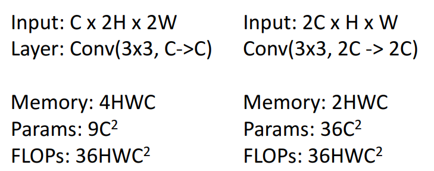

# 8강 - CNN Architectures

# AlexNet

[AlexNet.pdf](image/AlexNet.pdf)

- CNN이 컴퓨터 비전 연구의 주류가 된 해에 등장한 아키텍처입니다.
- **주요 특징**: 227x227 픽셀 입력, 5개의 합성곱 계층, 전반적인 최대 풀링, 3개의 완전 연결 계층, ReLU 비선형성 사용.
- **특이점**: 당시 GPU 메모리 제약으로 인해 2개의 GPU에 분산하여 학습되었습니다.
- **영향**: 컴퓨터 과학을 넘어 과학 전반에 걸쳐 가장 많이 인용된 논문 중 하나로 기록될 정도로 큰 영향을 미쳤습니다.
- **자원 사용 분석**:
    - **메모리**: 대부분의 메모리는 초기에 높은 공간 해상도를 가진 활성화 맵을 저장하는 데 사용됩니다.
    - **매개변수**: 대부분의 학습 가능한 매개변수는 네트워크의 마지막에 있는 완전 연결 계층에서 발생합니다.
    - **연산**: 대부분의 연산은 합성곱 계층에서 발생합니다.
- memory, params, FLOPs, MAC , FLOPS각각 뭘 의미하는지 알아야 한다
    - FLOPs: **FL**oating point **OP**eration**s -** 사칙연산, log, 지수 연산 등을 각각 1회 연산으로 계산
    MAC: **M**ultiply-**AC**cumulate - 곱하고 더하는 연산이 몇 번 시행되었는지
    ex) $ax+b$ → FLOPs: 2번, MAC: 1번
    - FLOPs이 크다고 params도 큰가 뭐 이런 관계에 대해서도 고민해보면 좋다
        - Conv 연산의 경우 가중치 공유에 의해 연산량은 많아도 params는 적을 수도 있다
        → 같은 가중치로 여러 번 연산하기 때문
    - float16을 float8로 바꾸면 어캐 되지? 이런 것도 고민해보면 좋다
        - 그만큼 메모리가 줄어든다

### Q. Local response normalization이 무엇이고, 이게 왜 Batch normalization에 밀렸는가?

- [https://taeguu.tistory.com/29](https://taeguu.tistory.com/29) - 참고
    - ReLU는 양수의 방향으로는 입력의값을 그대로 사용합니다. 그렇게되면 CONV나 POOLING시 매우 높은 하나의 픽셀 값이 주변의 픽셀에 영향을 미치게 되겠죠? 이런 부분을 방지하기 위해 다른 ActivationMap의 같은 위치에 있는 픽셀끼리 정규화를 해줍니다.
- Local Response Normalization (LRN) 설명:
    - 목적: ReLU의 특성으로 인해 발생할 수 있는 과도하게 큰 활성화 값을 억제하고, 주변 뉴런들과의 경쟁을 유도하기 위함이다.
    **특정 커널에서 매우 높은 활성화 값이 나타날 경우, 이것이 주변의 다른 특징 맵(Feature Map)에 영향을 주어 학습의 안정성을 해칠 수 있다고 판단**하였다. 이를 방지하기 위해 생물학적 신경계의 측방 억제 (Lateral Inhibition) 개념을 모델에 도입한 것이 바로 LRN 이다.
    - 작동 방식: 특정 위치 (x, y)에서 커널 i를 적용하고 ReLU 비선형성을 적용하여 계산된 뉴런의 활성화 a에 대해, 응답 정규화된 활성화 b는 다음 수식으로 주어집니다:
        
        $b^i_{x,y} = a^i_{x,y} / (k + \alpha \sum^{min(N-1, i+n/2)}_{j=max(0, i-n/2)}(a^j_{x,y})^2)^\beta$
        
        여기서 합계는 n개의 "인접한" 커널 맵에 걸쳐 실행됩니다. N은 레이어의 총 커널 수입니다. k, n, α, β는 검증 세트를 사용하여 결정되는 하이퍼파라미터입니다. AlexNet에서는 k=2, n=5, α=10^-4, β=0.75를 사용했습니다.
        
        **즉, 특정 뉴런의 활성화 값이 매우 크더라도 주변 채널의 활성화 값들의 제곱 합으로 나누어줌으로써 상대적으로 값을 억제하는 효과를 얻는다.**
        
    - 효과: LRN은 AlexNet에서 top-1 및 top-5 오류율을 각각 1.4%와 1.2% 감소시키는 효과를 보였습니다.
- LRN이 Batch Normalization (BN)에 밀린 이유:
    1. 내부 공변량 변화(Internal Covariate Shift) 해결: Batch Normalization은 훈련 중 각 레이어의 입력 분포가 변하는 현상인 '내부 공변량 변화'를 효과적으로 줄여줍니다. LRN은 이러한 문제를 해결하는 데는 한계가 있었습니다. **BN은 각 미니배치 내에서 전체적으로 활성화 값을 정규화하여(평균과 분산을 통해) 레이어 입력 분포를 안정화 시킵니다.**
    2. 훈련 속도 향상: BN은 더 높은 학습률(learning rate)을 사용할 수 있게 하여 네트워크 훈련 속도를 크게 향상 시킵니다. LRN은 이러한 훈련 속도 향상 효과가 미미했습니다.
    3. 정규화 효과: BN은 그 자체로 정규화(regularization) 효과를 제공하여, 드롭아웃(Dropout)과 같은 다른 정규화 기법의 필요성을 줄이거나 보완합니다. LRN의 정규화 효과는 BN에 비해 제한적이었습니다.
        1. **Batch Normalization** 은 단순히 수렴 속도를 빠르게 하는 도구가 아니라, 미니 배치 단위의 연산이 만드는 **Stochasticity (확률적 특성)(미니 배치는 무작위로 구성되므로 동일한 데이터 샘플이라도 어떤 샘플들과 함께 배치에 포함되느냐에 따라 정규화된 값 $\hat{x}_i$이 조금씩 달라진다.)** 를 통해 규제 효과를 발생시키는 기법이다. 따라서 배치 크기 (Batch Size) 가 너무 크면 노이즈가 줄어들어 정규화 효과가 약해질 수 있으며, 반대로 너무 작으면 통계량의 오차가 커져 학습 자체가 불안정해질 수 있다.
        2. **그래디언트 안정화:** 가중치 $W$ 가 $k \cdot W$ 로 커지더라도 **BN** 을 통과하면 그 결과값은 동일하다. 이는 가중치가 비정상적으로 커지는 것을 방지하며, 학습률 (Learning Rate) 을 높게 설정해도 학습이 폭발하지 않고 안정적으로 수렴하게 돕는다.
        $E[kx] = kE[x]; Var[kx]=k^2Var[x]$
    4. 성능 및 안정성: Batch Normalization은 더 깊은 네트워크에서 훈련의 안정성을 높이고 더 나은 성능을 달성하는데 훨씬 효과적임이 입증되었습니다. LRN은 깊은 네트워크에서는 그 효과가 미미하거나 오히려 성능 저하를 가져오는 경우도 있었습니다.

### Q. pooling layer의 연산량은 convolution layer보다 훨씬 작기 때문에, 때로는 사람들은 논문에서 pooling layer의 maximum을 잘 기재하지 않는다. 이게 뭔 말임?

- max-pooling 연산은 학습 가능한 파라미터도 없고 정말 단순한 연산이기 때문에, 논문에서는 새로 고안한 pooling이 아닌 이상 그렇게까지 자세하게 설명하거나 강조하지 않는다는 말인 것 같음

### Q. conv 3개를 연달아 넣은 구조를 택한 이유가 있을까?

- conv-pool 반복의 의미:
    - 이 패턴을 반복함으로써 네트워크는 점진적으로 이미지의 공간 해상도를 줄여나가면서, 동시에 더 깊고 추상적인 특징을 계층적으로 추출해 나갑니다.
    - 각 conv 레이어는 새로운 특징을 학습하고, pool 레이어는 이 특징들을 요약하고 압축하여 다음 conv 레이어가 더 넓은 영역의 정보를 바탕으로 고수준 특징을 학습할 수 있도록 준비합니다.
    - max pool은 특정 영역 내에서 가장 중요한 특징만 남기므로, 객체의 미세한 위치 변화에 덜 민감해져서 불변성을 확보 가능합니다.
- conv-conv-conv의 의미:
    - 특정 공간 해상도에서 더 깊고 풍부한 특징을 추출하고자 한 것이 아니였을까?
    - 같은 해상도 내에서 여러 특징을 추출하고자 진행 → 이 단계에서 해상도 크기가 13으로 매우 작기 때문에 downsampling 더 진행할 수 없었음

# ZFNet

[https://arxiv.org/pdf/1311.2901](https://arxiv.org/pdf/1311.2901)

- AlexNet의 저자 Matt Zeiler와 Rob Fergus의 이름을 딴 아키텍처로, 기본적으로 더 커진 AlexNet입니다.
- **주요 특징**: AlexNet과 유사한 구조를 가지지만, 첫 번째 합성곱 계층에서 11x11 스트라이드 4 대신 7x7 스트라이드 2를 사용하여 공간 해상도를 덜 공격적으로 다운샘플링하고, 후반 합성곱 계층의 필터 수를 늘렸습니다.
- **결과**: AlexNet보다 더 많은 연산량과 매개변수를 가지며, 오류율을 16.4%에서 11.7%로 크게 개선했습니다. 더 큰 네트워크가 더 좋은 성능을 낸다는 경향을 보여주었습니다.

### Q. Network 크기가 커진 만큼 VRAM도 많이 필요한데, 이 Network도 여러 GPU에 분산해서 진행했나?

- AlexNet에서는 GPU 2개를 가지고 분산시켜서 하는 sparse connections를 사용함
- ZFNet에서는 대신 dense connections를 사용함
    - 하나의 GPU를 사용했고 70 에폭(epoch)으로 12일 동안 학습시킨 후 training을 중단했다고 함

# VGG

[VGG.pdf](image/VGG.pdf)

- Karen Simonyan과 Andrew Zisserman이 제안한 아키텍처로, **체계적인 설계 원칙**을 따른 최초의 CNN 중 하나입니다.
- **주요 설계 원칙**:
    - 모든 합성곱 계층은 **3x3 커널, 스트라이드 1, 패딩 1**을 사용합니다.
    - 모든 풀링 계층은 **2x2 최대 풀링, 스트라이드 2**를 사용합니다.
    - 최대 풀링 계층 후에는 항상 **채널 수를 두 배**로 늘립니다.
    - **3x3 합성곱의 장점**: 7x7 합성곱 하나 대신 3x3 합성곱 3개를 쌓으면 동일한 수용장(receptive field)을 가지면서도 매개변수와 연산 비용이 적고, 더 많은 비선형성을 추가할 수 있습니다.
        - 입력과 출력 채널 $C$로 동일할 때 param 수 → 3x3 3개=$27$$C^2$, 7x7 1개=$49C^2$
    
    
    
    - 해상도를 2배 줄이고 채널을 2배 늘리면 같은 연산량으로 더 적은 메모리에 더 많은 파라미터 추가 가능 → 효율적으로 파라미터 추가 가능
- **유명 버전**: VGG16 (16개 계층)과 VGG19 (19개 계층)가 있습니다.
- **비교 (AlexNet 대비)**: VGG는 AlexNet보다 훨씬 거대한 네트워크로, 메모리 사용량 25배, 매개변수 2배 이상, 연산 비용 19배 이상 높습니다. 이는 더 큰 네트워크가 더 좋은 성능을 낸다는 경향을 다시 한번 보여주었습니다.

# GoogLeNet

[GoogLeNet.pdf](image/GoogLeNet.pdf)

- Google 팀이 개발한 아키텍처로, **효율성**에 중점을 둔 것이 특징입니다.
- **주요 혁신**:
    - **Stem Network**: 초기 계층에서 입력 이미지를 적극적으로 다운샘플링하여 이후 계층의 계산 비용을 줄입니다.
    - **Inception Module**: 병렬 계산 브랜치를 도입하여 여러 크기의 필터(1x1, 3x3, 5x5 합성곱, 최대 풀링)를 동시에 적용하고 그 결과를 연결(concatenate)합니다. 이를 통해 커널 크기를 하이퍼파라미터로 튜닝할 필요 없이 모든 커널 크기를 포괄합니다.
    채널 방향으로 결합된 결과물은 다양한 크기의 수용장(Receptive Field)에서 얻은 정보를 모두 포함하게 된다. 이는 모델이 공간적으로 다양한 스케일의 특징을 동시에 학습할 수 있게 만드는 핵심 요소이다.
    - **1x1 합성곱 사용**: 비싼 공간 합성곱 전에 채널 수를 줄이는 데 사용됩니다 (병목 계층).
    - **Global Average Pooling (GAP)**: 네트워크의 마지막에 완전 연결 계층 대신 사용하여 매개변수 수를 크게 줄입니다. → flatten 대용으로 사용 한 것 즉, Cx1x1으로 만들기 위함
    - **Auxiliary Classifiers**: 배치 정규화가 발견되기 전, 깊은 네트워크의 학습을 돕기 위해 중간 계층에 보조 분류기를 추가하여 기울기 소실 문제를 완화했습니다. → 기울기가 중간에 사라지니까 기울기를 중간중간에 주입하자 → BN 이후로는 이 trick 필요 없어짐
        - 학습하는 동안, 보조 분류기의 loss는 0.3 가중치만큼 total loss에 더해진다
        $L_{total}=L_{final}+0.3(L_{aux1}+L_{aux2})$
        - 보조 분류기의 loss는 $L_{final}$과 똑같이 1000개 class 분류할 때의 loss로 진행
        - 추론 단계에서는 보조 분류기는 무시된다
        - 중간 지점에서도 분류 성능이 나오도록 변별력 있는 특징을 학습하도록 강제한다
        → 추가적인 정규화
- **결과**: VGG와 유사한 성능을 달성하면서도 훨씬 적은 매개변수와 연산 비용을 가집니다.

## Inception Module

### Q. Inception Module에서 마지막에 Filter concatenation을 하는데, 다양한 conv 연산을 수행하면 각 branch마다 차원 수가 다른데 이걸 어떻게 concatenation 한다는 거임?

- 해상도는 같다 따라서 채널 방향으로 concat하면 된다

## Global Average Pooling

```python
nn.AdaptiveAvgPool2d(1)
```

### Q. max pool과 avg pool 사용 효과에서 어떤 차이가 발생? 지금까지 Network들 내부에서 max pool 썼는데 끝에 flatten 대신 avg pool 쓴거 max pool 써도 되는거 아님?

- 특징 맵 전체에 대한 정보를 반영하고 싶어서 avg pool 쓴게 아닐까

## Auxiliary(보조) Classifiers

### Q. 왜 network가 깊어질 수록 gradient를 잘 전달하지 못하는 걸까?

- 깊어질 수록 역전파 시 upstream과 local과 곱하는 횟수가 많아짐
$f = ReLU(W_3ReLU(W_2ReLU(W_1x)))$에서 $W_1$까지 역전파 한다면
$\frac{\partial L}{\partial f}W_3W_2x$와 같이 W들이 많이 곱해지는데 이 W에 따라 gradient가 소실 될 수도 폭발할 수도 있다
- ReLU에 의해 죽은 뉴런 현상이 발생할 수도 있다

### Q. VGG는 network가 깊어질 때 생기는 문제를 어떻게 해결했을까?

- 그래서 최대 19까지 쌓은 것으로 예상됨. 그 이상 쌓으면 gradient flow 이슈가 생겨서 그러지 않았을까

### Q. Batch normalization이 network 깊어질 때 gradient를 잘 전달하지 못하는 문제를 어떻게 해결하는 것인가?

- 분포를 재조정 함으로써 죽은 뉴런 문제가 발생하지 않도록 억제

# ResNet(Residual Networks)

[ResNet.pdf](image/ResNet.pdf)

- 이미지넷 챌린지에서 혁신적인 성능 향상을 이룬 아키텍처로, **매우 깊은 네트워크** 학습을 가능하게 했습니다.
- **깊이 증가의 문제**: 배치 정규화 이후에도 네트워크를 단순히 깊게 쌓으면 (예: 20계층 vs 56계층) 오히려 훈련 오류가 증가하는 현상(퇴보 문제, Degradation Problem)이 발생했습니다. 이는 과적합이 아니라 최적화의 어려움 때문입니다.
- **Residual Block (잔차 블록)** [[48:45](http://www.youtube.com/watch?v=XaZIlVrIO-Q&t=2925)]:
    - 입력 `X`를 두 개의 합성곱 계층을 거친 출력 `F(X)`에 직접 더하는 **항등 매핑(Identity Mapping)** 또는 **지름길 연결(Shortcut Connection)**을 도입합니다: `F(X) + X`.
    - 이를 통해 사용되지 않는 계층이 항등 함수를 쉽게 학습할 수 있게 하여 깊은 네트워크의 최적화를 용이하게 합니다.
    - 기울기가 더 효율적으로 전달되어 깊은 네트워크에서 기울기 소실 문제를 완화합니다 [[49:59](http://www.youtube.com/watch?v=XaZIlVrIO-Q&t=2999)].
- **ResNet 아키텍처 설계**:
    - VGG와 GoogleNet의 아이디어를 결합: VGG의 단순한 설계 원칙(3x3 합성곱, 단계별 채널 두 배, 공간 해상도 절반)과 GoogleNet의 공격적인 Stem, Global Average Pooling을 사용합니다.
    - **Basic Block**: 3x3 합성곱 두 개와 지름길 연결로 구성됩니다.
    - **Bottleneck Block**: 더 깊은 ResNet(ResNet-50, 101, 152)에 사용되며, 1x1 합성곱으로 채널 수를 줄인 후 3x3 합성곱을 수행하고 다시 1x1 합성곱으로 채널 수를 늘리는 구조입니다. 이는 계산 비용을 유지하면서 더 깊은 네트워크를 구축할 수 있게 합니다.
- **성과**: 2015년 이미지넷 챌린지의 모든 트랙과 Microsoft COCO 챌린지를 석권했습니다. ResNet-50 및 ResNet-101은 현재까지도 널리 사용되는 강력한 기준 모델입니다.

### Q. deeper model은 shallower model의 layer를 복사하고, 나머지 extra layers는 항등으로 설정했을 때 성능이 적어도 shallower model만큼 잘 나와야 한다. 따라서 identity function이 쉽게 학습할 수 있도록 residual block을 만들었다. 여기서 항등 함수를 학습한다는 것이 무슨 의미인가? 그리고 input 값을 끝에 그대로 더하는 방식이 어떻게 도움을 줄 수 있다는 말인가?


- 기존 모델에 항등 함수를 추가로 단다면 결국 출력 값은 기존 모델과 똑같으므로 성능 또한 기존 모델만큼 나와야 한다
- x 자체가 최적화에서 답이라고 했을 때, H(x)가 x가 되기를 기대하는 것보다 x 자체를 출력에 그대로 밀어 넣고 중간을 0으로 만드는게 더 쉽다
- 따라서 F(x)는 H(x) - x만큼의 잔차를 학습하게 되는 것이고, 이 것이 잔차 블록인 이유이다
- 수평 방향 엣지를 검출하고 난 후 특징 맵에는 수평 방향 엣지 정보만 담겨 있기 때문에 그 다음 수직 방향 엣지를 검출한다면 아무 것도 포착되지 않는다
잔차 연결을 한다면 기존의 이미지 정보가 남아있기 때문에 수평 방향 엣지 검출 이후 수직 방향 엣지를 검출할 때 검출 가능하게 된다

### Q. Original ResNet block의 문제점이 뭐고 Pre-Activation ResNet block이 왜 해결 방안인건가?


- 논문 - [Identity Mappings in Deep Residual Networks](https://arxiv.org/pdf/1603.05027)
- Original 같은 경우 사실상 찐으로 항등 함수를 학습하는 것이 아니다. 왜냐하면 ReLU에 의해 무조건 양수로 만들어버리기 때문에 만약 입력이 음수이더라도 무조건 양수가 나오게 된다
- 따라서 음수 입력에 대해서도 찐으로 항등 함수를 학습하기 위해서 Pre-Activation으로 만들었다

### Q. Pre-Activation ResNet block 성능 약간이라도 오르는데 왜 잘 안 쓰는건가?

- 성능 향상이 미미하고 이미 많은 사람들이 Original 블록을 가지고 모델 구현했기 때문
- 논문에서 이 방식은 엄청나게 깊은 모델에 대해서 의미가 있다고 함 약 1000?

# ResNeXt (2016년)


- 논문 - [Aggregated residual transformations for deep neural networks](https://arxiv.org/pdf/1611.05431)
- ResNet의 후속작으로, Residual Block 내에 **여러 개의 병렬 경로(parallel pathways)**를 추가하는 아이디어입니다.
- 각 병렬 경로는 작은 Bottleneck Block으로 구성되며, 이들을 합산하여 최종 출력을 만듭니다.
- 계산 비용을 유지하면서 병렬 경로의 수를 늘리면 성능이 향상되는 것을 보여주었습니다.

## Grouped Convolution


- G개 만큼 병렬적으로 conv 수행
- 각 group마다 $C_{in}$$/G$만큼의 채널 크기를 입력으로 conv 수행
→ 각 group마다 $C_{out}/G$만큼의 채널 크기로 결과가 나옴
→ 채널 방향으로 concat하면 $C_{out}$ 크기가 됨
- MobileNet의 Depthwise Convolution은 $G=C_{in}$인 경우임


# Squeeze-and-Excitation Networks


- 논문 - [Squeeze-and-Excitation networks](https://arxiv.org/pdf/1709.01507)
- ResNeXt 위에 "Squeeze-and-Excitation"이라는 작은 모듈을 추가하여 성능을 더욱 향상시킨 아키텍처입니다.
- 각 채널 별로 가중치를 계산해서 반영하려는 아이디어
- 이를 통해 global context를 반영할 수 있게 됨 → 기존 conv는 각 채널 별로 독립적으로 진행함
- 이 구조가 Attention으로 넘어감

# Densely Connected Neural Networks

# MobileNets


- Depthwise Conv → Pointwise Conv로 수행함
- 실질적인 연산은 Pointwise Conv로 1x1 Conv가 주됨


- 일반적인 Conv 경우 연산량이 (필터 크기) * (필터 개수) * (출력 해상도)


- Depthwise의 경우 (필터 크기) * (필터 개수 == 입력 채널 수) * (출력 해상도)
- Pointwise의 경우 (필터 크기) * (필터 개수) * (출력 해상도)

## Im2Col & GEMM


- Img to column
- General Matrix to Matrix Multiplication
- 연산량만 줄어든다고 능사가 아니다 → 하드웨어 수준에서도 효율적이어야 한다
- 1x1 Conv의 경우 커널을 굳이 reshape 할 필요 없기 때문에 다른 Conv 연산보다 더 효율적이다
- MobileNet의 연산은 대부분 Pointwise(= 1x1 Conv)에서 진행하기 때문에 **하드웨어 수준에서도 매우 효율적인 모델이다**

# Neural Architecture Search

### Q. 그래서 이거 대체 뭐냐? 강화 학습과 관련이 있으니까 논문 리뷰 ㄱㄱ

[NAS 정리.pdf](image/NAS_%EC%A0%95%EB%A6%AC.pdf)

[Neural Architecture Search 의문점 정리.pdf](image/Neural_Architecture_Search_%EC%9D%98%EB%AC%B8%EC%A0%90_%EC%A0%95%EB%A6%AC.pdf)

# EfficientNet

- 논문 - [EfficientNet: Rethinking Model Scaling for Convolutional Neural Networks](https://arxiv.org/pdf/1905.11946)
- 네트워크의 깊이, 채널, 해상도 중 하나만 키워도 정확도가 오르지만 모델이 커질수록 정확도 오르는 정도가 감소한다
- 해상도가 커지면 그만큼 더 많은 픽셀 영역을 봐야 하기 때문에 요구되는 수용 영역의 크기가 커진다
그만큼 모델의 깊이가 깊어야 하며 또한 고해상도 이미지의 세밀한 표현들을 더 많이 포착하기 위해서는 채널 수가 증가 되어야 한다
- 모바일넷은 지연 시간 최적화가 목표, 이 네트워크에서는 특정 하드웨어에 종속되지 않는 범용적인 모델을 위해 FLOPS를 최적화 대상으로 함
- 결론은 깊이, 채널, 해상도 모두 균형적으로 증가되어야 한다
- 기본적으로 MBConv(Mobile inverted Bottleneck Convolution)를 사용
    - https://lynnshin.tistory.com/53
- EfficientNet 구조: Expand → Depthwise → SE → Project
    - https://lynnshin.tistory.com/13

---

# 8강 발표 질문사항 정리 내용입니다

1. GoogLeNet의 Inception Module에서 다양한 크기의 filter를 거친 결과를 concate할 때 차원 통일 방식
- concate하는 경우 크기가 같아야 하므로 spatial size(H×W)가 같도록 stride와 padding을 조정.
1. GoogLeNet의 Auxiliary Classifier가 Batch Norm의 등장 이후로 더 이상 사용되지 않는 이유는?
- Auxiliary Classifier가 사용됐던 가장 큰 이유는 층이 깊어짐에 따라 기울기 소실을 완화하기 위해서인데 각 layer에 Batch Norm을 추가함으로써 각 layer의 출력 분포를 정규화해 기울기 흐름을 원활하게 유지하기 때문에 그 역할을 대신함. 학습 구조를 복잡하게 하거나 추가 연산을 요구하지 않으면서 그 역할을 훌륭하게 대신하기 때문에 Auxiliary Classifier는 더 이상 사용되지 않게 됨.
1. Squeeze-and-Excitation Networks가 각 채널에 중요도를 부여하는 원리는? (103페이지의 오른쪽 그림 순서대로)
- Global (Avg) Pooling (Squeeze 단계): 각 채널의 평균값을 구해 하나의 벡터로 표현, 각 채널이 전체 이미지에서 얼마나 활성화되었는지를 요약. 출력값은 채널의 활성화 정도.
- FC → ReLU → FC → Sigmoid (Excitation 단계): 입력에 대해 두번의 FC층을 통과시키고 최종적으로 Sigmoid 함수를 통과시켜 각 채널 c_i의 중요도 스코어 확률적으로 계산.
- 어떤 채널이 중요한지는 정답(label)에 따라 역전파(backpropagation)를 통해 네트워크가 스스로 판단.
- 중요도가 의미하는 바: 이 채널이 이 이미지를 올바르게 분류하는 데 기여했는가?
- 각 채널의 전체 활성도를 기반으로 학습을 통해 중요도를 계산하며, 이 중요도는 실제 분류에 도움이 되는 정도를 반영하여 중요한 채널은 강조하고 덜 중요한 채널은 억제함으로써 네트워크의 표현력을 높임.